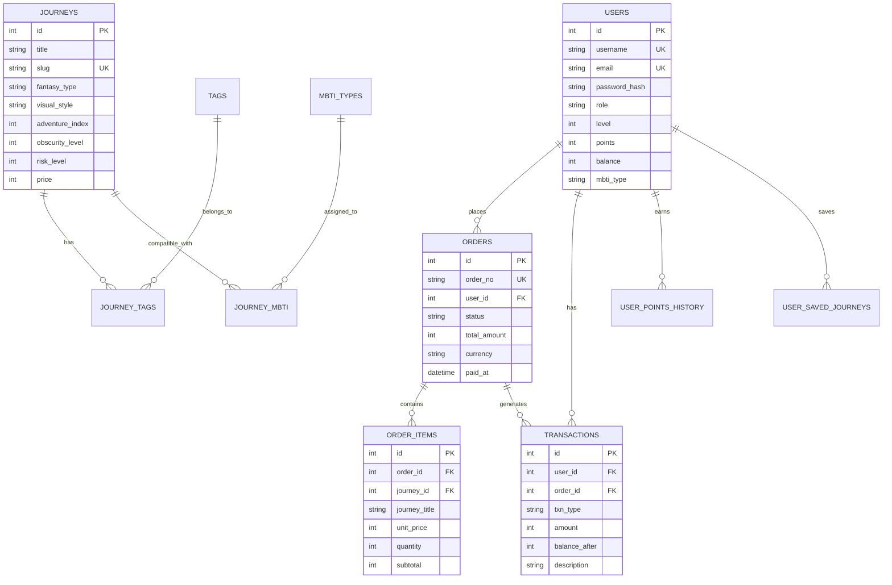

# 100 Journeys — 100种不可思议的旅行

[](https://github.com/LibertychaserUS/100-journeys/actions)
[](https://github.com/LibertychaserUS/100-journeys/actions)
[](https://golang.org)
[](LICENSE)

A lightweight MVP web app showcasing unconventional travel experiences, built with Go + Gin + SQLite. Features AI-powered travel recommendations, a virtual currency system (不思议币), user points/levels, and full order/payment flows with audit trails.

## Features

| Feature | Description |
|---------|-------------|
| **AI Travel Companion** | Pixel-art AI pet with MBTI-based personality quiz and journey recommendations |
| **Journey Explorer** | Filter by fantasy type, visual style, adventure index, and MBTI compatibility |
| **Virtual Currency** | 不思议币 (WonderCoin) simulated payment with 7-tier game-style recharge |
| **Points & Levels** | 5,000 welcome points; Lv1-Lv6 with discounts 0%-15% |
| **Order System** | Multi-item checkout, unique order numbers, atomic payment transactions |
| **User Profile** | Balance, order history, transaction ledger with full audit trail |
| **Admin Dashboard** | Content management for journeys, tags, and MBTI associations |

## Tech Stack

| Layer | Technology |
|-------|-----------|
| Backend | Go 1.26+ / Gin |
| Database | SQLite via `modernc.org/sqlite` (pure Go, no CGO) |
| Frontend | Vanilla HTML / CSS / JavaScript |
| Routing | Hash-based SPA routing (`/#/`) |
| Images | Local static (CDN-ready via `window.APP_CONFIG`) |
| E2E Tests | Playwright |

## Development Methodology

- **SDD** — ISO/IEC/IEEE 29148:2018 (Requirements Engineering)
- **DDD** — IEEE 1016-2009 (Software Design Descriptions)
- **TDD** — ISO/IEC/IEEE 29119-3 (Test Documentation)

## Quick Start

```bash
# Clone
git clone https://github.com/LibertychaserUS/100-journeys.git
cd 100-journeys

# Install Go dependencies
go mod tidy

# Start server (default: http://localhost:8080)
go run cmd/server/main.go

# Or with custom port
PORT=8090 go run cmd/server/main.go
```

### Run Tests

```bash
# Go unit & integration tests
go test ./...

# E2E tests (starts server automatically)
cd e2e && npx playwright test
```

## Project Structure

```
100-journeys/
├── cmd/server/          # Entry point
├── internal/
│   ├── handler/         # Gin HTTP handlers
│   ├── service/         # Business logic
│   ├── repository/      # DB access layer (SQLite)
│   ├── model/           # Data structures
│   ├── middleware/      # JWT, CORS, RequestID, Recovery
│   └── ai/              # Mock AI engine + recommend engine
├── db/
│   ├── schema.sql       # DDL (journeys, users, orders, transactions)
│   └── seed.sql         # Sample data (5 journeys, 16 MBTI types)
├── web/
│   ├── index.html       # SPA shell
│   ├── css/             # tokens → global → layout → components → pages
│   ├── js/              # Router, API client, page controllers
│   └── assets/images/   # Local media
├── docs/
│   ├── schema/          # SDD artifacts + API contract
│   ├── ui-components/   # DDD artifacts
│   ├── testing/         # TDD test plans
│   ├── trace/           # Checkpoints + development log
│   └── prompts/         # AI prompt records (5 phases)
├── e2e/                 # Playwright E2E tests
└── README.md
```

## Database ER Diagram



## API Overview

All endpoints return a standard envelope: `{ data, error, total?, page?, limit? }`

| Method | Path | Auth | Description |
|--------|------|------|-------------|
| GET | `/api/journeys` | No | List journeys with filters |
| GET | `/api/journeys/:slug` | No | Get journey detail |
| GET | `/api/tags` | No | List all tags |
| POST | `/api/auth/register` | No | Register new account |
| POST | `/api/auth/login` | No | Login |
| GET | `/api/auth/me` | JWT | Current user profile |
| POST | `/api/orders` | JWT | Create order |
| GET | `/api/orders` | JWT | List my orders |
| POST | `/api/orders/:id/pay` | JWT | Pay order (atomic) |
| POST | `/api/payments/recharge` | JWT | Rebalance WonderCoin |
| GET | `/api/payments/transactions` | JWT | Transaction ledger |

Full specification: [`docs/schema/api-contract.md`](docs/schema/api-contract.md)

## Test Status

| Suite | Count | Status |
|-------|-------|--------|
| Go Unit/Integration | 51 | All green |
| E2E (Playwright) | 29 | All green |
| Coverage — Repository | 84.2% | Target >= 80% |
| Coverage — Handler | 78.6% | Target >= 70% |

## Virtual Currency System

The app uses a simulated currency called **不思议币** (WonderCoin).

- **Recharge Tiers**: 60 / 300 / 680 / 1,280 / 3,280 / 6,480 / 9,980
- **Bonus Amounts**: up to +2,888 bonus at highest tier
- **Security**: All payments use atomic SQLite transactions with full audit trail
- **Discounts**: Automatic level-based discounts (0%-15%) applied at order creation

## Image / CDN Configuration

Images are served locally by default. To switch to CDN:

```bash
MEDIA_PROVIDER=cdn CDN_BASE_URL=https://cdn.example.com go run cmd/server/main.go
```

The frontend reads `window.APP_CONFIG.mediaBase` injected by the server at startup.

## License

MIT
