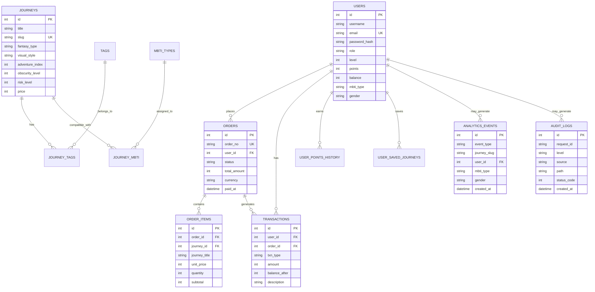

# 100 Journeys — 100种不可思议的旅行

[](https://github.com/LibertychaserUS/100-journeys/actions)
[](https://github.com/LibertychaserUS/100-journeys/actions)
[](https://golang.org)
[](LICENSE)

> **EN** A lightweight MVP web app showcasing unconventional, story-driven travel experiences, built with Go + Gin + SQLite. Features AI-powered travel recommendations, a virtual currency system (WonderCoin), user points/levels, order/payment flows, analytics, and audit trails.
>
> **CN** 一款轻量级 MVP Web 应用，展示故事驱动的不可思议旅行体验。基于 Go + Gin + SQLite 构建，支持 AI 旅行推荐、虚拟货币系统（不思议币）、用户积分/等级体系、订单/支付流程、分析统计与审计追踪。

---

## Features | 功能特性

| Feature | Description | 功能 | 描述 |
|---------|-------------|------|------|
| **AI Travel Companion** | Pixel-art AI pet with MBTI-based personality quiz and journey recommendations | **AI 旅行伴侣** | 像素风 AI 宠物，支持 MBTI 性格测试与旅程推荐 |
| **Journey Explorer** | Filter by fantasy type, visual style, adventure index, and MBTI compatibility | **旅程探索** | 按奇幻类型、视觉风格、冒险指数、MBTI 匹配度筛选 |
| **Virtual Currency** | WonderCoin simulated payment with 7-tier game-style recharge | **虚拟货币** | 不思议币模拟支付，7 档游戏风充值档位 |
| **Points & Levels** | 5,000 welcome points; Lv1–Lv6 with discounts 0%–15% | **积分与等级** | 注册送 5,000 积分；Lv1-Lv6 自动折扣 0%-15% |
| **Order System** | Multi-item checkout, unique order numbers, atomic payment transactions | **订单系统** | 多商品结账、唯一订单号、原子级支付事务 |
| **User Profile** | Balance, order history, transaction ledger with full audit trail | **用户中心** | 余额、订单历史、交易流水与完整审计追踪 |
| **Admin Dashboard** | Real dashboard for users, orders, revenue, clicks, MBTI, gender, audit logs, and export | **管理后台** | 用户、订单、收入、点击、MBTI、性别、审计日志与导出 |

---

## Tech Stack | 技术栈

| Layer | Technology | 层级 | 技术 |
|-------|-----------|------|------|
| Backend | Go 1.26+ / Gin | 后端 | Go 1.26+ / Gin |
| Database | SQLite via `modernc.org/sqlite` (pure Go, no CGO) | 数据库 | SQLite (`modernc.org/sqlite`，纯 Go，无 CGO) |
| Frontend | Vanilla HTML / CSS / JavaScript | 前端 | 原生 HTML / CSS / JavaScript |
| Routing | Hash-based SPA routing (`/#/`) | 路由 | 基于 Hash 的单页路由 (`/#/`) |
| Images | Local static (CDN-ready via `window.APP_CONFIG`) | 图片 | 本地静态（通过 `window.APP_CONFIG` 切换 CDN) |
| E2E Tests | Playwright | E2E 测试 | Playwright |

---

## Development Methodology | 开发方法论

- **SDD** — ISO/IEC/IEEE 29148:2018 (Requirements Engineering) 需求工程
- **DDD** — IEEE 1016-2009 (Software Design Descriptions) 软件设计描述
- **TDD** — ISO/IEC/IEEE 29119-3 (Test Documentation) 测试文档

---

## Quick Start | 快速开始

```bash
# Clone | 克隆仓库
git clone https://github.com/LibertychaserUS/100-journeys.git
cd 100-journeys

# Install Go dependencies | 安装 Go 依赖
go mod tidy

# Start server (default: http://localhost:8080) | 启动服务（默认 8080）
go run cmd/server/main.go

# Or with custom port | 或指定端口
PORT=8090 go run cmd/server/main.go
```

### Run Tests | 运行测试

```bash
# Go unit & integration tests | Go 单元与集成测试
go test ./...

# Vet and JS syntax | Go 静态检查与 JS 语法检查
go vet ./...
find web/js -name '*.js' -exec node --check {} \;

# Medium-site stress profile | 中型独立站本地压力档
STRESS_PUBLIC_REQUESTS=3000 \
STRESS_ANALYTICS_EVENTS=20000 \
STRESS_USERS=100 \
STRESS_ORDERS=500 \
STRESS_ADMIN_REQUESTS=300 \
STRESS_IMAGE_REQUESTS=2000 \
go test -tags stress ./tests/stress -run TestStress -count=1 -timeout=360s

# E2E tests (starts server automatically) | E2E 测试（自动启动后端）
cd e2e && npx playwright test
```

---

## Project Structure | 项目结构

```
100-journeys/
├── cmd/server/          # Entry point | 入口
├── internal/
│   ├── handler/         # Gin HTTP handlers | HTTP 处理器
│   ├── service/         # Business logic | 业务逻辑
│   ├── repository/      # DB access layer (SQLite) | 数据访问层
│   ├── model/           # Data structures | 数据模型
│   ├── middleware/      # JWT, CORS, RequestID, Recovery | 中间件
│   └── ai/              # Mock AI engine + recommend engine | AI 引擎
├── db/
│   ├── schema.sql       # DDL (journeys, users, orders, transactions) | 数据库结构
│   └── seed.sql         # Sample data (5 journeys, 16 MBTI types) | 示例数据
├── web/
│   ├── index.html       # SPA shell | 单页壳
│   ├── css/             # tokens → global → layout → components → pages | 样式层
│   ├── js/              # Router, API client, page controllers | JS 模块
│   └── assets/images/   # Local media | 本地媒体资源
├── docs/
│   ├── schema/          # SDD artifacts + API contract | 软件设计文档
│   ├── ui-components/   # DDD artifacts | UI 设计文档
│   ├── testing/         # TDD test plans | 测试文档
│   ├── trace/           # Checkpoints + development log | 开发追踪
│   └── prompts/         # AI prompt records (5 phases) | 提示词记录
├── e2e/                 # Playwright E2E tests | E2E 测试
└── README.md
```

---

## Database ER Diagram | 数据库 ER 图



---

## API Overview | API 概览

All endpoints return a standard envelope: `{ data, error, total?, page?, limit? }`

所有接口返回统一信封格式：`{ data, error, total?, page?, limit? }`

| Method | Path | Auth | Description | 描述 |
|--------|------|------|-------------|------|
| GET | `/api/journeys` | No | List journeys with filters | 旅程列表（支持筛选） |
| GET | `/api/journeys/:slug` | No | Get journey detail | 旅程详情 |
| GET | `/api/tags` | No | List all tags | 标签列表 |
| POST | `/api/auth/register` | No | Register new account | 用户注册 |
| POST | `/api/auth/login` | No | Login | 用户登录 |
| GET | `/api/auth/me` | JWT | Current user profile | 当前用户信息 |
| POST | `/api/orders` | JWT | Create order | 创建订单 |
| GET | `/api/orders` | JWT | List my orders | 我的订单 |
| POST | `/api/orders/:id/pay` | JWT | Pay order (atomic) | 支付订单（原子事务） |
| POST | `/api/payments/recharge` | JWT | Recharge WonderCoin | 充值不思议币 |
| GET | `/api/payments/transactions` | JWT | Transaction ledger | 交易流水 |
| GET | `/api/admin/stats` | Admin | Real dashboard stats | 真实后台统计 |
| GET | `/api/admin/export` | Admin | Export stats as CSV/JSON | 导出统计 |
| POST | `/api/analytics/events` | No/JWT | Track P2 analytics events | 记录 P2 分析事件 |
| POST | `/api/audit/client-error` | No/JWT | Persist frontend errors | 持久化前端错误 |

Full specification: [`docs/schema/api-contract.md`](docs/schema/api-contract.md)

---

## Test Status | 测试状态

| Suite | Count | Status | 测试套 | 数量 | 状态 |
|-------|-------|--------|--------|------|------|
| Go Unit/Integration | current suite | Passing | Go 单元/集成测试 | 当前套件 | 通过 |
| Go Vet | current suite | Passing | Go 静态检查 | 当前套件 | 通过 |
| JS Syntax | current frontend | Passing | JS 语法检查 | 当前前端 | 通过 |
| Stress — medium profile | 6 surfaces | Passing | 中型独立站压力档 | 6 个面 | 通过 |
| E2E (Playwright) | browser flows | Fresh rerun required | E2E 测试 | 浏览器流程 | 需重新跑 |

---

## Virtual Currency System | 虚拟货币系统

The app uses a simulated currency called **不思议币** (WonderCoin).

本应用使用名为 **不思议币** (WonderCoin) 的模拟货币。

- **Recharge Tiers | 充值档位**: 60 / 300 / 680 / 1,280 / 3,280 / 6,480 / 9,980
- **Bonus Amounts | 赠送额度**: up to +2,888 bonus at highest tier | 最高档额外赠送 2,888
- **Security | 安全**: All payments use atomic SQLite transactions with full audit trail | 所有支付使用 SQLite 原子事务，附带完整审计追踪
- **Discounts | 折扣**: Automatic level-based discounts (0%–15%) applied at order creation | 下单时自动应用基于等级的折扣（0%-15%）

---

## Image / CDN Configuration | 图片 / CDN 配置

Images are served locally by default. To switch to CDN:

默认使用本地图片。切换至 CDN：

```bash
MEDIA_PROVIDER=cdn CDN_BASE_URL=https://cdn.example.com go run cmd/server/main.go
```

The frontend reads `window.APP_CONFIG.mediaBase` injected by the server at startup.

For production, move large images behind Nginx/CDN. Local Go static delivery passed 2000 concurrent image requests in stress tests, but 3000 local concurrent image requests exposed socket timeouts.

生产建议把大图迁到 Nginx/CDN。Go 本地直出静态图在 2000 并发请求通过，但 3000 本地并发图片请求已暴露连接超时。

---

## Production Notes | 生产说明

- Production readiness: [`docs/ops/PRODUCTION_READINESS.md`](docs/ops/PRODUCTION_READINESS.md)
- Disaster recovery: [`docs/ops/DISASTER_RECOVERY.md`](docs/ops/DISASTER_RECOVERY.md)
- SQLite backup script: `./scripts/backup-sqlite.sh ./data/app.db ./data/backups`

前端通过服务端启动时注入的 `window.APP_CONFIG.mediaBase` 读取图片基地址。

---

## License | 许可

MIT
