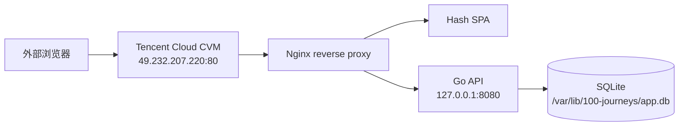
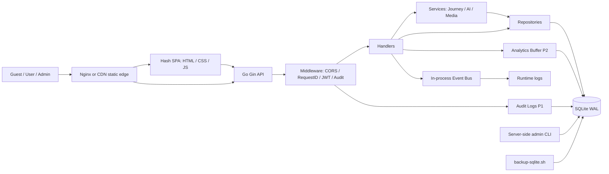
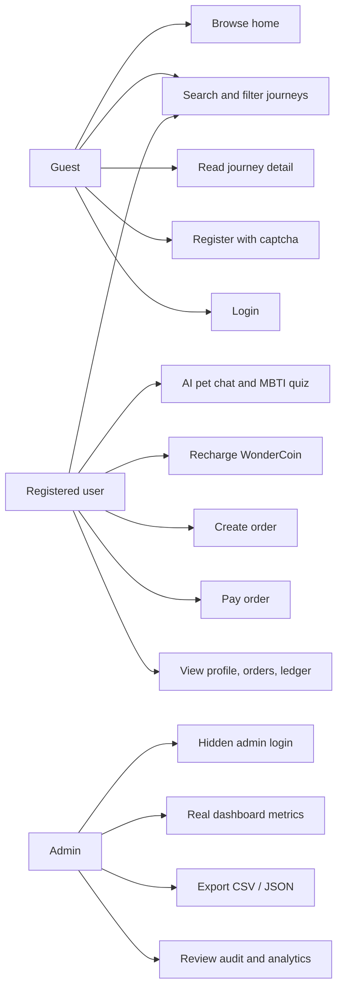
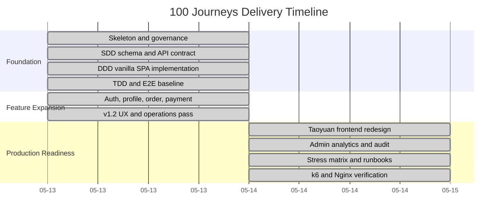

# 100 Journeys | 100种不可思议的旅行

[](https://github.com/LibertychaserUS/100-journeys/actions/workflows/ci.yml)
[](https://github.com/LibertychaserUS/100-journeys/actions/workflows/pages.yml)
[](docs/ops/LOAD_TEST_RESULTS.md)
[](docs/ops/LOAD_TEST_RESULTS.md)
[](docs/QUALITY_REVIEW_REPORT.md)

中文：**100种不可思议的旅行** 是一个轻量级全栈 Web App MVP，以“情绪 / MBTI / 隐藏身份 / 奇幻旅程”为入口，把旅行内容做成故事卡片、AI 宠物陪伴、WonderCoin 模拟下单和后台统计证据闭环。

English: **100 Journeys** is a lightweight full-stack Web App MVP for story-driven fantasy travel discovery. Users choose a mood, persona, or hidden world instead of browsing a conventional destination list.

Current delivery target: `main`; deployment hardening branch: `codex/tencent-cloud-deploy`

---

## Development Context | 开发语境

中文：本项目交付开发统一记录为 **使用已接入 Kimi API 的 Claude Code 完成**。Kimi API 通过本地 Claude Code launcher 接入后，Claude Code 负责需求拆解、SDD/DDD/TDD/E2E、全栈实现、测试验证和文档整理。

English: This delivery records the implementation context as **completed with Claude Code connected to the Kimi API**. Claude Code, backed by the Kimi API integration, was used for requirements breakdown, SDD/DDD/TDD/E2E, full-stack implementation, verification, and documentation.

---

## Live Demo | 在线演示

中文：当前域名备案尚未完成，因此公网演示使用腾讯云 CVM 的临时 IP 地址。备案通过后可将域名解析到 Nginx，并补充 HTTPS 证书。

English: The domain filing is not complete yet, so the public demo uses the Tencent Cloud CVM IP address. After filing, the domain can point to Nginx with HTTPS enabled.

| Item | URL / Account |
|---|---|
| Public demo | `http://49.232.207.220/` |
| User login | `http://49.232.207.220/#/login` |
| User account | `user@100journeys.demo` / `TaoyuanUser12345` |
| Hidden admin login | `http://49.232.207.220/#/admin-login` |
| Admin account | `admin@100journeys.demo` / `TaoyuanAdmin12345` |



---

## Product Position | 产品定位

中文：本项目不是传统旅行列表站，而是“桃源百旅”方向的内容型 MVP，围绕以下已实现能力构建。

English: The app is not a generic travel listing site. It is a compact content MVP built around:

- **情绪 / MBTI / 人设探索 | Mood / MBTI / persona discovery**: 搜索、情绪 chips、MBTI、幻想标签进入旅程。
- **故事卡片浏览 | Story-card browsing**: 图片卡片进入角色、任务、线索、风险和准备建议。
- **AI 宠物旅伴 | AI travel companion**: 像素宠物提供 MBTI 问答和推荐引导。
- **模拟交易 | Simulated commerce**: 注册、充值 WonderCoin、创建订单、钱包支付、交易流水。
- **后台证据闭环 | Admin evidence loop**: 管理员查看真实统计、点击、购买、性别/MBTI、审计日志，并导出 CSV/JSON。

---

## Tech Stack | 技术栈

| Layer | Technology | Constraint |
|---|---|---|
| Backend | Go + Gin | Pure Go, no CGO |
| Database | SQLite via `modernc.org/sqlite` | WAL mode, single-writer boundary, busy retry |
| Frontend | Vanilla HTML / CSS / JS | Hash SPA, no React/Vue |
| Auth | JWT + bcrypt + math captcha | Public registration cannot create admin |
| Analytics | Buffered P2 event queue | Drops are allowed only for non-critical analytics |
| Audit | Persistent `audit_logs` | API errors, panic, and frontend errors |
| Static media | Local-first JPG/SVG assets, CDN-ready fallback | Nginx/CDN recommended; `CDN_BASE_URL` is fallback for missing local media |
| Tests | Go tests, Go stress, k6, Playwright | k6/Nginx baseline verified; visual browser audit captured; Playwright 29/29 passing |
| CI/CD | GitHub Actions | Full-stack smoke added; remote run pending after push |
| Image assets | image2 + local JPG/SVG assets | image2 was used as an image generation/material tool; it is not the core code-development tool |

---

## Database Access | 数据库访问

中文：项目没有使用 GORM。数据库层采用 Go 标准 `database/sql`、`modernc.org/sqlite` 和 repository/service 分层。这样做的原因是本作业明确要求 SQLite、schema/API 契约、测试证据和可审计 SQL；手写参数化 SQL 更容易直接证明 `db/schema.sql`、API 行为和测试结果一致。

English: The project does not use GORM. It uses Go `database/sql`, `modernc.org/sqlite`, and repository/service layers so the SQLite schema, API contract, SQL statements, and tests remain directly auditable.

- 注册写入：`AuthHandler.Register` 校验验证码、用户名、密码和邮箱唯一性，然后 bcrypt 生成 `password_hash`，最后由 `UserRepository.Create` 用参数化 SQL 写入 `users`。
- P0/P1 写入：用户、订单、钱包支付、交易流水使用同步 SQL 和事务，不进入 analytics buffer。
- SQLite 并发：`repository.NewDB` 开启 WAL、foreign keys、busy timeout，并将连接限制为单连接；`retryBusy` 对 SQLite busy/lock 做短重试。
- P2 buffer：`analytics.Buffer` 只处理点击、搜索、筛选、宠物回复等非关键事件，默认容量 `32768`，批量写入 `analytics_events`；满了只丢 P2，不影响注册、下单或支付。

---

## System DAG | 系统设计 DAG



---

## User Cases | 用户用例



---

## Database ER Diagram | 数据库 ER 图

```mermaid
erDiagram
    JOURNEYS ||--o{ JOURNEY_TAGS : has
    TAGS ||--o{ JOURNEY_TAGS : categorizes
    JOURNEYS ||--o{ JOURNEY_MBTI : matches
    MBTI_TYPES ||--o{ JOURNEY_MBTI : assigned
    USERS ||--o{ USER_POINTS_HISTORY : earns
    USERS ||--o{ USER_SAVED_JOURNEYS : saves
    JOURNEYS ||--o{ USER_SAVED_JOURNEYS : saved_as
    USERS ||--o{ ORDERS : places
    ORDERS ||--o{ ORDER_ITEMS : contains
    JOURNEYS ||--o{ ORDER_ITEMS : snapshots
    USERS ||--o{ TRANSACTIONS : has
    ORDERS ||--o{ TRANSACTIONS : generates
    USERS ||--o{ ANALYTICS_EVENTS : may_emit

    JOURNEYS {
        int id PK
        string title NN
        string slug UK NN
        string fantasy_type NN
        string visual_style NN
        int adventure_index NN
        int risk_level NN
        int price NN
    }

    USERS {
        int id PK
        string username NN
        string email UK NN
        string password_hash NN
        string role NN
        int points NN
        int balance NN
        string gender NN
    }

    ORDERS {
        int id PK
        string order_no UK NN
        int user_id FK
        string status NN
        int total_amount NN
        datetime paid_at
    }

    ORDER_ITEMS {
        int id PK
        int order_id FK
        int journey_id FK
        string journey_title NN
        int unit_price NN
        int quantity NN
    }

    TRANSACTIONS {
        int id PK
        int user_id FK
        int order_id FK
        string txn_type NN
        int amount NN
        int balance_after NN
    }

    ANALYTICS_EVENTS {
        int id PK
        string event_type NN
        string journey_slug
        int user_id FK
        string mbti_type
        string gender
    }

    AUDIT_LOGS {
        int id PK
        string request_id
        string level NN
        string source NN
        string path
        int status_code
    }
```

Full generated ER source: [`docs/generated/database-er.mmd`](docs/generated/database-er.mmd)

---

## Delivery Gantt | 交付时间线



---

## API Surface | API 概览

中文：JSON API 使用统一响应信封 `{ data, error, total?, page?, limit? }`；`/api/admin/export?format=csv` 是 CSV 明确例外。

English: JSON API responses use the standard envelope `{ data, error, total?, page?, limit? }`; `/api/admin/export?format=csv` is the explicit CSV exception.

| Method | Path | Auth | Purpose |
|---|---|---|---|
| `GET` | `/api/journeys` | Public | List journeys with search/filter/pagination |
| `GET` | `/api/journeys/:slug` | Public | Journey detail |
| `GET` | `/api/tags`, `/api/mbti` | Public | Filter taxonomies |
| `POST` | `/api/auth/register`, `/api/auth/login` | Public | Captcha-aware auth |
| `GET` | `/api/auth/me` | JWT | Current profile |
| `POST` | `/api/auth/avatar` | JWT | Avatar upload |
| `POST` | `/api/orders` | JWT | Create multi-item order |
| `POST` | `/api/orders/:id/pay` | JWT | Atomic wallet payment |
| `POST` | `/api/payments/recharge` | JWT | Simulated WonderCoin recharge |
| `GET` | `/api/admin/stats` | Admin | Real dashboard stats |
| `GET` | `/api/admin/export` | Admin | CSV/JSON export |
| `POST` | `/api/analytics/events` | Public/JWT | Buffered P2 analytics |
| `POST` | `/api/audit/client-error` | Public/JWT | Frontend error audit |

Full generated route matrix: [`docs/generated/api-routes.md`](docs/generated/api-routes.md)

---

## Quick Start | 快速启动

```bash
git clone https://github.com/LibertychaserUS/100-journeys.git
cd 100-journeys
git switch main

go mod tidy
scripts/deploy/local-one-click.sh
```

Then open:

```text
The URL printed by the script, for example http://127.0.0.1:18080/
```

Create or promote an admin account server-side:

```bash
ADMIN_PASSWORD='replace-with-a-long-secret' \
go run ./cmd/admin-user \
  -db ./data/app.db \
  -email admin@example.com \
  -username admin
```

Generate deterministic demo data for dashboard review:

```bash
scripts/deploy/init-demo-data.sh ./data/demo.db
```

The demo generator creates 50 ordinary users and 3 admin users with bcrypt password hashes, local GitHub-style default avatars, complete required profile fields, paid orders, wallet transactions, saved journeys, analytics events, and audit evidence. Usernames may repeat in product terms; ownership is bound to the server-side account identity, not displayed as an internal database ID.

Demo accounts after initialization:

| Role | Account |
|---|---|
| User | `user@100journeys.demo` / `TaoyuanUser12345` |
| Admin | `admin@100journeys.demo` / `TaoyuanAdmin12345` |

## One-Click Local Deploy | 本地一键部署

中文：本地验收推荐直接使用一键脚本。脚本会初始化 SQLite、演示用户、管理员、订单、流水和后台统计数据，并自动选择空闲端口。如果默认 `18080/18081` 被占用，会自动顺延到下一个可用端口；连续递增 5 次仍不可用时，会说明现实原因并退出。

English: For local review, use the one-click script. It initializes SQLite, demo users, admins, orders, transactions, and dashboard evidence, then auto-selects free ports when the defaults are occupied.

```bash
scripts/deploy/local-one-click.sh
```

Stop it:

```bash
scripts/deploy/local-one-click.sh --stop
```

Full local guide: [`docs/ops/LOCAL_ONE_CLICK_GUIDE.md`](docs/ops/LOCAL_ONE_CLICK_GUIDE.md)

---

## Verification | 验证方式

核心检查 | Core checks:

```bash
GOCACHE="$PWD/.cache/go-build" go test ./...
GOCACHE="$PWD/.cache/go-build" go vet ./...
find web/js -name '*.js' -exec node --check {} \;
```

Medium-site Go stress profile:

```bash
STRESS_PUBLIC_REQUESTS=3000 \
STRESS_ANALYTICS_EVENTS=20000 \
STRESS_USERS=100 \
STRESS_ORDERS=500 \
STRESS_ADMIN_REQUESTS=300 \
STRESS_IMAGE_REQUESTS=2000 \
GOCACHE="$PWD/.cache/go-build" \
go test -tags stress ./tests/stress -run TestStress -count=1 -timeout=360s
```

Nginx + k6 本地验证 | Local Nginx + k6:

```bash
scripts/nginx/render-local-config.sh 18080 18081
nginx -t -c "$PWD/deploy/nginx.local.conf" -p "$PWD/.nginx"

BASE_URL=http://127.0.0.1:18080 VUS=200 DURATION=30s k6 run tests/load/public-content-flow.k6.js
BASE_URL=http://127.0.0.1:18080 VUS=80 DURATION=30s k6 run tests/load/order-payment-audit.k6.js
BASE_URL=http://127.0.0.1:18080 VUS=300 DURATION=30s k6 run tests/load/image-static-cache.k6.js
```

Playwright E2E:

```bash
cd e2e
npx playwright test
```

Current evidence status | 当前证据状态:

| Area | Status |
|---|---|
| Go unit/integration | Passing: `go test ./...` |
| Go vet | Passing: `go vet ./...` |
| JS syntax | Passing: `node --check` over `web/js` |
| Go stress target profile | Passing: `ok .../tests/stress 7.040s` |
| k6 | Local Nginx baseline recorded; Tencent Cloud public-IP smoke passed within Nginx rate limit |
| Browser visual audit | Captured real desktop/mobile pages, profile, recharge, and admin dashboard screenshots from local Nginx |
| Playwright | Passing: `29 passed` on 2026-05-14 |
| Nginx/CDN | Local Nginx verified; Tencent Cloud Nginx reverse proxy deployed on `http://49.232.207.220/`; public API is rate-limited; HTTPS waits for filed domain |
| CI/CD | `.github/workflows/ci.yml` added; remote GitHub Actions result pending after push |

---

## Deployment Position | 部署口径

中文：GitHub Pages 只能托管静态 SPA shell，不能运行 Go API，也不能持久化 SQLite。全栈部署必须使用能运行 Go 进程并保存 SQLite 数据目录的服务器。

English: GitHub Pages can host only the static SPA shell. Full-stack deployment needs a host that runs the Go API and preserves the SQLite data directory.

Deployment paths:

| Path | Fit | Notes |
|---|---|---|
| Tencent Cloud CVM public IP | Current external demo | Go + SQLite + Nginx on `http://49.232.207.220/`; no domain filing required for IP demo |
| Tencent Cloud filed domain | Formal China mainland domain path | Requires ICP filing before domain points to mainland CVM |
| Local/demo | Development proof | `go run`, SQLite file, local generated images |
| Alibaba Cloud mainland ECS | Alternative China-access candidate after ICP | Requires ICP filing for formal mainland-domain service |
| Alibaba Cloud HK/Singapore | Possible no-mainland-ICP host | Full-stack deployable, mainland access still best-effort |
| Railway/Fly/Render paid small instance | Low-ops full-stack option | Needs paid persistent storage for reliable SQLite |
| GitHub Pages + external API | Static preview only | Not enough for current full-stack product |
| Vercel static asset preview | Possible for the dynamic Hash SPA shell only | Current Go + SQLite full stack is not Vercel-native without external API/storage redesign |
| CDN/R2/OSS for images | Future media layer | Mirror public assets and use `CDN_BASE_URL` as a missing-local fallback or edge cache source |

Current demo URL: `http://49.232.207.220/`

Hidden admin route: `http://49.232.207.220/#/admin-login`

Current choice: Tencent Cloud CVM public IP demo. Formal domain deployment waits for ICP filing and HTTPS certificate setup.

当前选择：腾讯云 CVM 公网 IP 演示。正式域名部署等待备案和 HTTPS 证书配置。

Operational docs:

- [`docs/ops/PRODUCTION_READINESS.md`](docs/ops/PRODUCTION_READINESS.md)
- [`docs/ops/DISASTER_RECOVERY.md`](docs/ops/DISASTER_RECOVERY.md)
- [`docs/ops/LOAD_TEST_RESULTS.md`](docs/ops/LOAD_TEST_RESULTS.md)
- [`docs/ops/LOCAL_ONE_CLICK_GUIDE.md`](docs/ops/LOCAL_ONE_CLICK_GUIDE.md)
- [`deploy/nginx.conf`](deploy/nginx.conf)

---

## Documentation Evidence | 文档证据

| Artifact | Purpose |
|---|---|
| [`docs/PRD.md`](docs/PRD.md) | Current product requirements derived from implemented behavior |
| [`docs/INITIAL_PRD.md`](docs/INITIAL_PRD.md) | Initial assignment PRD and original requirement baseline |
| [`docs/schema/SDD-spec.md`](docs/schema/SDD-spec.md) | Schema/API-driven requirements baseline |
| [`docs/ui-components/DDD-spec.md`](docs/ui-components/DDD-spec.md) | UI component/design description baseline |
| [`docs/testing/TDD-spec.md`](docs/testing/TDD-spec.md) | Test plan and RED/GREEN evidence |
| [`docs/ops/LOAD_TEST_RESULTS.md`](docs/ops/LOAD_TEST_RESULTS.md) | Nginx and k6 execution evidence |
| [`docs/workflow/AI_DEVELOPMENT_WORKFLOW.md`](docs/workflow/AI_DEVELOPMENT_WORKFLOW.md) | Claude Code + Kimi API workflow explanation |
| [`docs/workflow/DOCUMENTATION_EVOLUTION.md`](docs/workflow/DOCUMENTATION_EVOLUTION.md) | Documentation history and Git-stage evolution |
| [`docs/SUBMISSION.md`](docs/SUBMISSION.md) | Final submission checklist, email format, and attachment list |
| [`docs/generated/`](docs/generated/) | Code-derived diagrams and route/test matrices |
| [`docs/prompts/prompt-log.md`](docs/prompts/prompt-log.md) | Prompt trace |
| [`app.xlsx`](app.xlsx) | Submission test-case spreadsheet |

Regenerate code-derived docs:

```bash
python3 scripts/docs/generate_project_artifacts.py
```

---

## Known Boundaries | 已知边界

- `user_saved_journeys` exists, but full favorite API UX still needs final completion or explicit local-only scope.
- SQLite is acceptable for this MVP and medium single-node demo, not for unlimited high-concurrency production.
- Analytics events are P2 and may degrade under extreme pressure; P0 orders/payments do not use the lossy buffer.
- Local Go static image serving is not the production plan; use Nginx/CDN/R2 for image traffic. The current service resolves local assets first and falls back to `CDN_BASE_URL` only when a local file is missing.
- Production must use HTTPS; local HTTP is only a Nginx/k6 test fixture.
- k6 baseline, visual browser audit, and full scripted Playwright E2E have been refreshed locally; Tencent Cloud HTTP demo has been smoke-tested, while HTTPS waits for filed domain setup.
- Without ICP filing, do not claim formal mainland China deployment on Alibaba Cloud mainland resources.

---

## Submission | 提交方式

中文：按作业要求，提交邮件应包含源码压缩包、文档包、Prompt 记录、工作流说明、GitHub/Gitee 仓库链接和公网演示地址。

English: The submission email should include the source archive, documentation package, prompt records, workflow explanation, GitHub/Gitee repository link, and public demo URL.

| Item | Value |
|---|---|
| Email | `xulei@wisquest.com` |
| Subject | `【远程作业提交】姓名` |
| Required attachments/links | ZIP source package, Markdown docs, `docs/prompts/prompt-log.md`, `docs/workflow/AI_DEVELOPMENT_WORKFLOW.md`, GitHub/Gitee link, demo URL |
| Deadline | Within 72 hours after receiving the assignment |
