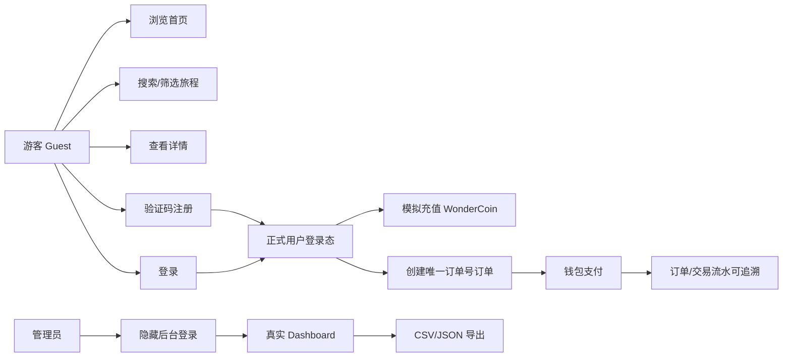

# BDD 业务行为规格 - 100 Journeys

> BDD 场景来源于 `docs/USER_CASES.md`、`docs/schema/api-contract.md`、`docs/testing/TDD-spec.md`、`e2e/tests/*.js` 和 `tests/load/*.js`，用于把业务行为、验收标准和自动化测试对应起来。

## 1. 范围

本 BDD 文档描述当前实现的游客、正式用户、管理员三类角色的核心行为。它不引入新功能承诺；未实现能力以 `docs/USER_CASES.md` 和 `README.md` 的已知边界为准。

## 2. 角色

| 角色 | 业务目标 | 自动化证据 |
|---|---|---|
| 游客 | 浏览首页、搜索筛选、查看旅程详情、注册/登录 | `e2e/tests/home.spec.js`、`explore.spec.js`、`detail.spec.js`、`auth.spec.js` |
| 正式用户 | 自动登录、充值、下单、支付、查看订单与流水 | `e2e/tests/orders.spec.js`、`tests/load/order-payment-audit.k6.js` |
| 管理员 | 隐藏入口登录、查看真实统计、导出 CSV/JSON、审计错误 | `internal/handler/admin_handler_test.go`、`tests/load/admin-analytics-export.k6.js` |

## 3. Mermaid 行为流

## 4. Given/When/Then 场景

### BDD-001 游客浏览与详情

Given 游客打开 Hash SPA 首页  
When 点击旅程卡片或探索页筛选条件  
Then 前端进入对应 `#/journey/:slug` 或 `#/explore`，后端返回标准 envelope，页面展示故事、标签、价格、风险和准备建议。

### BDD-002 注册与登录态

Given 游客输入 username、email、password、gender 和 captcha  
When 调用 `/api/auth/register`  
Then 系统创建 role=`user` 的账号、bcrypt 保存密码哈希、返回 JWT，并在顶栏显示头像、用户名、钱包和积分。

### BDD-003 自动登录

Given 本地存在有效 token  
When 用户刷新或重新打开站点  
Then 前端调用 `/api/auth/me` 恢复登录态；token 无效时回到游客态。

### BDD-004 模拟充值

Given 正式用户进入充值页  
When 选择充值档位或输入自定义金额  
Then `/api/payments/recharge` 增加 WonderCoin 余额并写入 `transactions` 充值流水。

### BDD-005 下单与支付追溯

Given 正式用户有足够余额  
When 从详情页创建订单并支付  
Then 系统生成唯一 `order_no`，订单和明细落库，支付在事务中扣减余额并写入 purchase 流水；后台可通过统计和导出追溯金额。

### BDD-006 游客购买拦截

Given 游客在详情页点击购买  
When 没有有效 JWT  
Then 页面提示先登录，并提供进入登录页的动作，而不是静默失败或 404。

### BDD-007 管理员后台

Given 管理员通过隐藏路由 `#/admin-login` 登录  
When 打开 `#/admin`  
Then Dashboard 从真实数据库聚合用户、订单、收入、点击、MBTI、性别、审计错误，并支持 CSV/JSON 导出。

### BDD-008 P2 分析缓冲降级

Given 短时间内产生大量点击、搜索、宠物回复事件  
When `analytics.Buffer` 压力升高  
Then P2 analytics 可以丢弃或延后，但 P0 注册、下单、支付、交易流水不得进入可丢 buffer。

## 5. 验收映射

| BDD 场景 | 主要验收文件 |
|---|---|
| BDD-001 | `e2e/tests/home.spec.js`、`e2e/tests/explore.spec.js`、`e2e/tests/detail.spec.js` |
| BDD-002/003 | `e2e/tests/auth.spec.js`、`internal/handler/auth_handler_test.go` |
| BDD-004/005 | `e2e/tests/orders.spec.js`、`internal/handler/order_handler_test.go`、`tests/load/order-payment-audit.k6.js` |
| BDD-006 | `web/js/pages/detail.js`、`e2e/tests/orders.spec.js` |
| BDD-007 | `internal/handler/admin_handler_test.go`、`tests/load/admin-analytics-export.k6.js` |
| BDD-008 | `internal/analytics/*_test.go`、`tests/stress/stress_test.go` |
