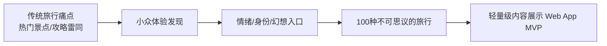
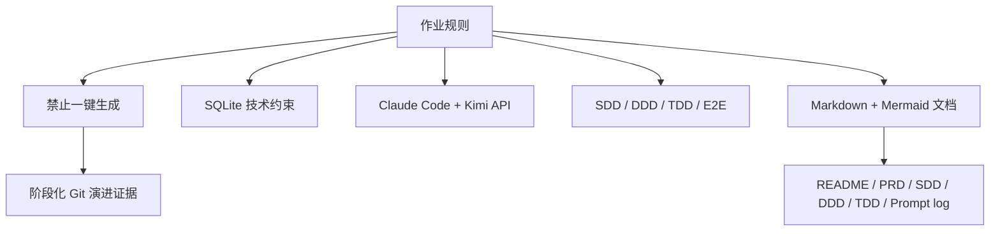
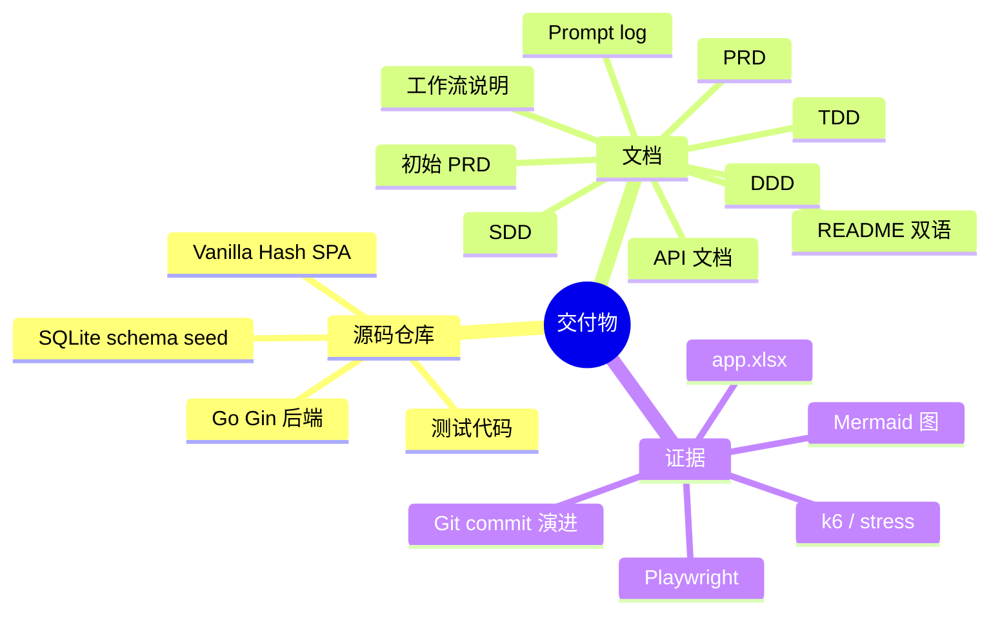

# 初始 PRD - AI 开发实习生远程作业

> 文档性质：本文件沉淀用户提供的原始作业要求，作为本项目全部后续 PRD、SDD、DDD、TDD、E2E 与交付文档的起点。
> 项目主题：`100种不可思议的旅行 - 轻量级内容展示 Web App MVP`
> 开发工具要求：必须使用 **Claude Code**，并明确接入 **Kimi API**。本项目交付语境统一为：使用已接入 Kimi API 的 Claude Code 完成全部开发。
> 文档格式要求：Markdown 文档，关键结构使用 Mermaid 图。

---

## 1. 背景与业务需求

### 1.1 产品定位

原始需求要求打造一个极致小众、视觉冲击强、非主流旅行方式的内容展示平台。

核心价值主张：

- 发掘那些“你从未想过可以这样旅行”的独特体验。
- 为追求个性化、差异化旅行方式的用户提供灵感与发现渠道。
- 不是传统旅行 App 的目的地列表，而是面向“不可思议体验”的内容 MVP。

### 1.2 目标用户画像

| 用户群体 | 特征描述 | 核心诉求 |
|---|---|---|
| 95 后 / 00 后 Z 世代 | 数字原住民，追求个性表达，乐于分享 | 寻找能彰显个性的独特旅行方式，获得社交货币 |
| 反常规生活方式追求者 | 拒绝千篇一律，追求深度体验和主题精神满足 | 发现真正有深度、有意义的旅行体验 |
| 视觉系内容消费者 | 注重审美体验，喜欢高质量图片和氛围感 | 获得视觉享受，发现“值得打卡”的目的地 |

### 1.3 用户痛点分析

1. **同质化严重**：传统旅行 App 推荐内容千篇一律，热门景点、网红打卡地重复率高。
2. **发现效率低**：真正独特的小众玩法散落在各平台，缺乏聚合入口。
3. **情绪共鸣缺失**：内容偏功能介绍，缺少情绪连接和故事性。
4. **筛选维度单一**：建议按“体验类型”“视觉风格”“小众程度”等个性化维度筛选。

### 1.4 作业要求

本作业要求使用 **Claude Code（必须接入 Kimi 模型）**，从 0 到 1 完成一个极简但有生产级感的内容展示 MVP。

核心考察点：

- 多范式融合的工程化架构：SDD + DDD + TDD。
- SDD：前期基于业务需求驱动数据建模与 API 契约。
- DDD：中期使用 UI UX Pro Max，以视觉交互设计驱动前端组件与状态。
- TDD：后期针对核心逻辑严谨测试驱动，并包含完整 E2E 测试。
- 必须使用 Everything Claude Code / Claude Code 作为唯一核心工程执行环境。
- AI 协同效能：Prompt 的结构化表达与问题修正能力。
- 产品还原度：对“不可思议”业务痛点的理解与功能落地。

---

## 2. 重要规则

| 规则 | 初始要求 | 本项目落实方式 |
|---|---|---|
| 禁止一键生成 | 严禁用单一 Prompt 直接生成整个项目代码 | Prompt log 拆成 SDD、DDD、TDD、E2E、Feature、Docs 阶段 |
| 技术栈 | SQLite；前后端框架不限 | Go + Gin + `modernc.org/sqlite`；Vanilla HTML/CSS/JS |
| 开发范式 | 必须体现 SDD、DDD、TDD、E2E | 对应文档位于 `docs/schema`、`docs/ui-components`、`docs/testing`、`e2e` |
| 原创性 | 必须从 0 到 1 创建 | 由 Git 历史、trace、checkpoint、prompt-log 记录演进 |
| 工具限制 | 主体开发必须使用 Claude Code，明确接入 Kimi 模型 | README、PRD、workflow、prompt-log 均记录“接入 Kimi API 的 Claude Code” |
| 工具加分 | 鼓励使用 skills、MCP 等优化开发流程 | 使用 Superpowers、Playwright、文档生成脚本、Nginx/k6 验证 |

---

## 3. 交付物要求

缺任意一项视为不合格：

1. **完整项目源码**：GitHub/Gitee 链接，包含代码、数据库初始化脚本、至少 5 条高质量样例数据、开发文档、PRD/API/测试文档、README、后台账号说明、Git Commit 演进历史。
2. **核心 Prompt 记录文档**：至少 5 段，必须体现 SDD、DDD、TDD、E2E，并在每段 Prompt 后附意图、挑战和修正说明。
3. **开发过程思路与工作流说明**：1-1.5 页，说明如何通过 Claude Code 结合 Kimi API 开发，记录 2-3 个典型问题和解决路径，并阐述对工程化 AI 开发的理解。

---

## 4. 从初始 PRD 到当前实现的映射

| 初始要求 | 当前实现/文档 |
|---|---|
| 轻量级内容展示 Web App MVP | `README.md`、`web/`、`cmd/server/main.go` |
| 100 种不可思议旅行方向 | 当前 seed 为 12 条高质量样例，架构支持继续扩展 |
| SQLite | `db/schema.sql`、`internal/repository/db.go` |
| SDD | `docs/schema/SDD-spec.md`、`docs/schema/api-contract.md` |
| DDD + UI UX Pro Max | `docs/ui-components/DDD-spec.md`、`web/css/tokens.css` |
| TDD + E2E | `docs/testing/TDD-spec.md`、`e2e/tests/*.spec.js` |
| Prompt 记录 | `docs/prompts/prompt-log.md` |
| 工作流说明 | `docs/workflow/AI_DEVELOPMENT_WORKFLOW.md` |
| Markdown + Mermaid | `README.md`、`docs/generated/*.mmd`、本文件 |
| 后台账号说明 | README 与 ops 文档记录管理员 CLI / demo-data 边界 |
