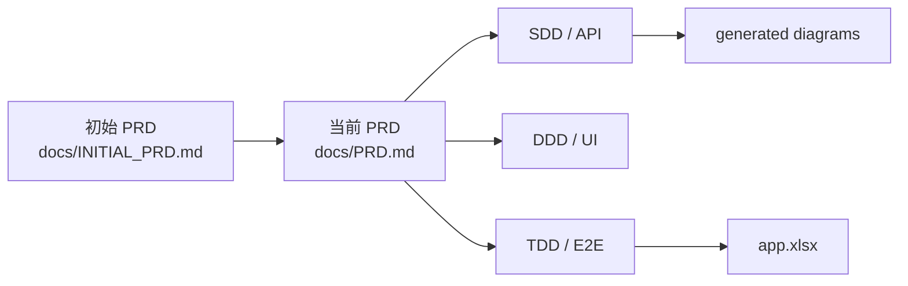

# PRD - 100种不可思议的旅行

> 版本: 2026-05-14 production-readiness branch
> 分支: `feature/taoyuan-production-readiness`
> 标准对齐: ISO/IEC/IEEE 29148:2018 Requirements Engineering 风格
> 追踪原则: PRD 必须与代码、schema、路由、测试证据和生成图表一致。

---

## 0. 标准对齐

本文档是产品级需求文档，用 ISO/IEC/IEEE 29148:2018 的需求质量原则组织：范围明确、干系人明确、需求可验证、接口和数据可追踪、验收证据可审计。

### 0.1 开发工具语境

本项目全部开发记录统一为：**使用已接入 Kimi API 的 Claude Code 完成**。Claude Code 是实际工程执行工具，Kimi API 是其本地接入的模型/服务后端；需求拆解、SDD/DDD/TDD/E2E、全栈实现、测试验证和交付文档均按该开发语境归档。

图片素材说明：项目中的生成类旅行图、品牌图和默认头像资产可记录为使用 **image2** 辅助生成或整理。image2 只作为图片资产生成工具，不作为主体代码开发工具。

| 标准关注点 | PRD 章节 | 证据规则 |
|---|---|---|
| 目的与范围 | 1、9 | 明确产品目的和不做什么 |
| 干系人需求 | 2 | 游客、注册用户、管理员、审阅者、维护者分离 |
| 系统需求 | 3、4 | 使用稳定 ID：`FR-*`、`NFR-*` |
| 接口与数据 | 5、6 | 指向 `db/schema.sql` 和生成路由矩阵 |
| 验证 | 8、10 | 结论必须有测试、k6、Nginx、CI 或文档证据 |

关联文档：

- 初始 PRD: `docs/INITIAL_PRD.md`
- SDD/API: `docs/schema/SDD-spec.md`、`docs/schema/api-contract.md`
- DDD/UI: `docs/ui-components/DDD-spec.md`
- TDD/Test: `docs/testing/TDD-spec.md`、`docs/testing/test-plan.md`
- 负载与运维: `docs/ops/PRODUCTION_READINESS.md`、`docs/ops/LOAD_TEST_RESULTS.md`
- 生成证据: `docs/generated/`
- 文档演进: `docs/workflow/DOCUMENTATION_EVOLUTION.md`



## 1. 产品定位

`100种不可思议的旅行` 是一个轻量级全栈内容 MVP。它不是传统旅游列表站，而是以“情绪 / MBTI / 隐藏身份 / 奇幻旅程”为入口的故事化旅行探索应用。

当前产品表达为 **桃源百旅**：

```text
情绪/MBTI/隐藏身份
-> 故事卡片探索
-> 旅程详情：角色、任务、线索、风险、准备建议
-> WonderCoin 模拟下单支付
-> 管理后台统计、审计、导出
```

支付和预订均为模拟能力；本项目交付目标是 AI 开发实习生远程作业的可运行 MVP，不是真实旅游交易平台。

## 2. 用户与干系人

| 用户/角色 | 需求 | 当前证据 |
|---|---|---|
| 95后/00后游客 | 第一屏快速感知“不可思议旅行”的调性 | 首页 hero、生成 JPG 卡片、情绪入口 |
| 反套路生活方式用户 | 不走传统热门路线，按幻想类型和心情筛选 | Explore filters、MBTI、tag、adventure |
| 沉浸式内容用户 | 像进入轻度故事游戏一样阅读旅行 | Detail 页角色/任务/线索 UI |
| 注册用户 | 维护账号、钱包、积分、订单、流水 | Auth、Profile、Recharge、Orders |
| 管理员 | 查看真实数据并导出提交证据 | Admin stats、CSV/JSON export |
| 审阅者 | 审计开发方法、测试证据、文档一致性 | `docs/generated/`、`app.xlsx`、CI workflow |

## 3. 功能需求

### 3.1 公开探索

| ID | 需求 | 状态 | 证据 |
|---|---|---|---|
| `FR-DISC-001` | 首页必须在第一屏表达幻想旅行定位。 | 已实现 | `web/js/pages/home.js` |
| `FR-DISC-002` | 首页和卡片必须使用真实静态/生成图片资产。 | 已实现 | `web/assets/images/generated/*.jpg` |
| `FR-DISC-003` | 探索页必须支持关键词、tag、MBTI、视觉风格、幻想类型、冒险指数筛选。 | 已实现 | `web/js/pages/explore.js`、`JourneyFilter` |
| `FR-DISC-004` | 前端筛选值必须匹配后端枚举，不发送纯展示中文标签。 | 已实现 | `explore.js` value/label maps |
| `FR-DISC-005` | 卡片标题和主要信息不得被 hover 蒙层遮挡。 | 已实现 | `web/css/pages/home.css`、`explore.css` |

### 3.2 旅程详情

| ID | 需求 | 状态 | 证据 |
|---|---|---|---|
| `FR-DETAIL-001` | 详情页必须展示标题、图片、故事钩子、正文、标签、MBTI、价格。 | 已实现 | `detail.js`、`journey_service.go` |
| `FR-DETAIL-002` | 详情页必须表达临时身份、任务、线索、风险和准备建议。 | 已实现 | `Pages.Detail._roleFor`、`_missionFor` |
| `FR-DETAIL-003` | 可购买旅程必须能创建订单。 | 已实现 | `API.createOrder`、`OrderHandler.Create` |
| `FR-DETAIL-004` | 收藏/保存旅程如未完成，必须明确标记。 | 未完成 | 表和 repository 存在，handler 草稿未注册；前端当前仅本地 UI toggle |

### 3.3 认证与个人中心

| ID | 需求 | 状态 | 证据 |
|---|---|---|---|
| `FR-AUTH-001` | 用户注册必须包含 username、email、password、gender、captcha。 | 已实现 | `RegisterRequest`、`register.js` |
| `FR-AUTH-002` | 密码必须 bcrypt 哈希存储。 | 已实现 | `bcrypt.GenerateFromPassword` |
| `FR-AUTH-003` | 公开注册不得通过 payload 注入 admin role。 | 已实现/已测试 | `TestAuth_Register_IgnoresInjectedAdminRole` |
| `FR-AUTH-004` | 登录后导航必须展示头像、用户名、余额、积分，不展示内部数据库 ID。 | 已实现 | `nav.js`、`profile.js` |
| `FR-AUTH-005` | 个人中心必须展示钱包、积分、订单和交易流水。 | 已实现 | `profile.js` |

### 3.4 订单、钱包、审计账本

| ID | 需求 | 状态 | 证据 |
|---|---|---|---|
| `FR-PAY-001` | 新用户获得初始积分。 | 已实现 | `userRepo.AddPoints(..., "register")` |
| `FR-PAY-002` | 充值为 WonderCoin 模拟充值，立即增加余额。 | 已实现 | `PaymentHandler.Recharge` |
| `FR-PAY-003` | 订单创建支持多 item。 | 已实现 | `CreateOrderRequest` |
| `FR-PAY-004` | 支付必须事务化更新余额、订单状态和交易流水。 | 已实现 | `OrderRepository.Pay` |
| `FR-PAY-005` | 订单 item 必须保存下单时旅程标题和价格快照。 | 已实现 | `order_items` |
| `FR-PAY-006` | P0 订单/钱包不得依赖可丢 buffer。 | 已实现 | `orders`、`transactions` |

### 3.5 AI 宠物

| ID | 需求 | 状态 | 证据 |
|---|---|---|---|
| `FR-AI-001` | AI 宠物必须提供聊天和推荐回复。 | mock/rule 已实现 | `mock_ai.go`、`ai-pet.js` |
| `FR-AI-002` | AI 宠物必须支持 MBTI 问答并引导到筛选页。 | 已实现 | `ai-pet-dom.js` |
| `FR-AI-003` | 宠物回复事件可记录为 P2 analytics。 | 已实现 | `pet-chat-analytics.k6.js` |

### 3.6 管理后台

| ID | 需求 | 状态 | 证据 |
|---|---|---|---|
| `FR-ADMIN-001` | 管理后台入口对游客和普通用户不可见。 | 已实现 | `#/admin-login`、`nav.js` |
| `FR-ADMIN-002` | 管理员只能由服务器侧 CLI 创建或提升。 | 已实现 | `cmd/admin-user` |
| `FR-ADMIN-003` | 后台统计必须来自真实 DB 聚合。 | 已实现 | `AdminRepository.Stats` |
| `FR-ADMIN-004` | 后台必须支持 CSV/JSON 导出。 | 已实现 | `AdminHandler.ExportStats` |
| `FR-ADMIN-005` | 统计列表字段必须稳定返回数组。 | 已实现/已测试 | `TestAdmin_Stats_EmptyMetricListsReturnArrays` |

## 4. 非功能需求

| ID | 需求 | 状态 | 证据 |
|---|---|---|---|
| `NFR-SEC-001` | SQL 查询必须参数化。 | 已实现 | repository methods |
| `NFR-SEC-002` | API 请求必须有 request ID 和审计记录。 | 已实现 | `RequestID`、`AuditLogger` |
| `NFR-SEC-003` | panic 必须被捕获并写入审计。 | 已实现 | `AuditRecovery` |
| `NFR-PERF-001` | SQLite 写入必须使用单写边界和 busy retry。 | 已实现 | `repository.NewDB` |
| `NFR-PERF-002` | P2 analytics burst 必须不拖垮 P0。 | 已验证 | 20000 stress、k6 pet |
| `NFR-PERF-003` | 静态图片生产必须走 Nginx/CDN/R2。 | 已验证本地 Nginx | `LOAD_TEST_RESULTS.md` |
| `NFR-DEPLOY-001` | 生产公网必须使用 HTTPS。 | 已写入模板 | `deploy/nginx.conf` |
| `NFR-CICD-001` | 全栈 CI 必须覆盖 Go、JS、docs、Nginx、k6 smoke。 | 已新增 | `.github/workflows/ci.yml` |
| `NFR-DOC-001` | 图表必须从代码或 schema 生成/对齐。 | 已实现 | `generate_project_artifacts.py` |

## 5. 数据模型

权威 DDL：`db/schema.sql`
生成 ER：`docs/generated/database-er.mmd`

核心表：

- `journeys`、`tags`、`journey_tags`、`mbti_types`、`journey_mbti`
- `users`、`user_points_history`、`user_saved_journeys`
- `orders`、`order_items`、`transactions`
- `analytics_events`、`audit_logs`

边界：

- `transactions` 是 P0 财务审计账本。
- `analytics_events` 是 P2，可降级。
- `audit_logs` 是 P1 运维证据，高流量下需要归档或异步化。
- `user_saved_journeys` 表存在，但收藏 API/UX 未完成。

## 6. API 模型

生成路由矩阵：`docs/generated/api-routes.md`
详细契约：`docs/schema/api-contract.md`

主要路由族：

- Public: `/api/journeys`、`/api/tags`、`/api/mbti`
- Auth: `/api/captcha`、`/api/auth/register`、`/api/auth/login`、`/api/auth/me`、`/api/auth/avatar`
- Orders: `/api/orders`、`/api/orders/:id`、`/api/orders/:id/pay`
- Payments: `/api/payments/recharge`、`/api/payments/transactions`
- Admin: `/api/admin/users`、`/api/admin/stats`、`/api/admin/export`
- Observability: `/api/analytics/events`、`/api/audit/client-error`、`/api/health`

JSON API 使用 envelope：

```json
{ "data": {}, "error": null, "total": 0, "page": 1, "limit": 12 }
```

CSV 导出是明确例外。

## 7. 部署需求

当前外部演示方案：

```text
External browser
-> Tencent Cloud CVM public IP: 49.232.207.220
-> Nginx reverse proxy and static cache
-> Go Gin API
-> SQLite WAL on persistent block volume
-> backup-sqlite.sh scheduled backup
```

### 7.1 腾讯云 CVM

当前公网演示运行在腾讯云 CVM：Nginx 对外监听 80，Go 服务仅监听 `127.0.0.1:8080`，SQLite 数据目录位于服务器持久化路径。由于域名备案尚未完成，演示 URL 使用公网 IP：`http://49.232.207.220/`。

### 7.2 域名、备案与 HTTPS

正式域名访问需要先完成 ICP 备案。备案完成后，将域名解析到腾讯云 CVM 或 CDN/Edge 入口，并配置 HTTPS 证书。当前 HTTP 公网 IP 仅作为作业演示入口，不宣称正式生产 HTTPS 域名已经完成。

### 7.3 其他云与备案

阿里云或其他中国大陆云厂商可以部署全栈，但分两类：

- **中国大陆地域**：正式公网域名访问通常需要 ICP 备案；未备案不作为正式域名交付路线。
- **阿里云香港/新加坡等非大陆地域**：可部署全栈，无中国大陆 ICP 备案要求，但大陆访问仍是 best-effort，不保证国内优化。

因此当前采用腾讯云 CVM 公网 IP 作为可外部登录的临时演示方案。

## 8. 测试与证据需求

当前本轮证据：

- 文档生成：`python3 scripts/docs/generate_project_artifacts.py` 通过。
- Go stress 目标组合档：`ok github.com/100-journeys/app/tests/stress 7.040s`。
- Nginx：语法检查、API 反代、静态图片响应头均通过。
- 浏览器视觉审查：已捕获桌面/移动页面、个人页、充值页和后台 dashboard 截图，个人页只展示用户名等用户资料，不展示内部数据库 ID。
- k6：public、image、pet、order、auth baseline、admin baseline 通过。
- k6 重压边界：auth 120 VU 与 admin 60 VU 功能正确但 p95 超阈值。
- `app.xlsx` 已由生成测试用例 CSV 构建。

仍需最终刷新：

- 全量 `go test ./...` 已通过。
- 全量 `go vet ./...` 已通过。
- JS syntax check 已通过。
- Playwright E2E: 2026-05-14 按当前动态前端复跑，29/29 通过。
- GitHub Actions 远端实际运行结果

## 9. 已知边界

| 边界 | 产品决策 |
|---|---|
| 真实支付 | 不做；WonderCoin 模拟 |
| 真实旅游预订 | 不做；只保留 booking 信息展示 |
| 真实 LLM | 不做；当前 mock/rule engine |
| 收藏功能 | 表存在，完整 API/UX 未完成 |
| SQLite | 可支撑单机 MVP；不是无限高并发数据库 |
| 后台导出 | 管理低频操作；60 VU 连续导出为容量边界 |
| 中国大陆访问 | 无备案时不承诺国内优化 |
| HTTPS | 生产必须 HTTPS；本地 HTTP 仅为压测夹具 |

## 10. 验收清单

- [x] schema/API/路由图表可由脚本生成。
- [x] PRD/SDD/DDD/TDD 文档为当前代码事实，不写旧状态。
- [x] Nginx 本地代理和静态图片路径已验证。
- [x] k6 基线负载已执行并记录。
- [x] admin 空榜单 JSON 契约问题已修复并补测试。
- [x] CI workflow 已补齐全栈 smoke。
- [ ] 全量 Go test/vet/JS check 最终复跑。
- [x] Playwright E2E 最终复跑：`29 passed`，入口 `http://localhost:8090`。
- [ ] CI 推送后远端通过。
- [x] 腾讯云 CVM 公网 IP 演示部署完成：Nginx、Go systemd、SQLite、普通用户/管理员公网登录已验证。
- [ ] 域名备案和 HTTPS 证书配置完成后补正式域名证据。

## 11. PRD 结论

本项目可以按“中型独立站 MVP，具备可运行全栈、真实事务链路、Nginx/k6 证据和明确生产边界”提交。不得宣称无限生产级、真实支付、无备案大陆优化或完整收藏功能。
