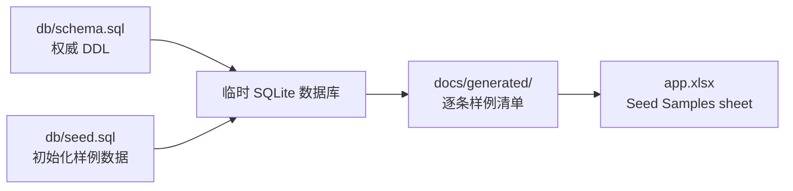

# 样例数据说明

> 交付要求：数据库初始化脚本必须包含至少 5 条高质量样例数据。当前 `db/seed.sql` 初始化 12 条旅程、8 个标签、16 个 MBTI 类型，并为每条旅程绑定标签和 MBTI 匹配关系。

## 1. 数据来源与生成链路

说明：权威数据源是 `db/seed.sql`。运行 `python3 scripts/docs/generate_project_artifacts.py` 时，脚本会临时加载真实 schema/seed，并同步生成 `docs/generated/` 下的逐条样例清单和 `app.xlsx` 的 Seed Samples sheet；审阅时可以直接对照 `db/seed.sql`。

## 2. 样例质量标准

| 维度 | 标准 |
|---|---|
| 内容完整 | 每条旅程包含标题、slug、副标题、故事 hook、正文、地区、类型、视觉风格、风险、价格和图片路径 |
| 业务可用 | 每条旅程可进入详情页、可下单、可进入订单快照 |
| 个性化 | 每条旅程绑定标签和 MBTI 匹配分 |
| 审计可追溯 | 价格进入订单、订单明细和交易流水 |
| 图片本地化 | `image_path` 指向本地静态资源文件名，支持 CDN fallback |

## 3. 逐条样例数据索引

| # | slug | 标题 | 地区 | 类型 | 模拟价格 |
|---:|---|---|---|---|---:|
| 1 | `bolivia-salt-flat-trek` | 徒步穿越玻利维亚盐沼 | 南美洲 · 玻利维亚 | solitude | 15999 |
| 2 | `iceland-lava-tunnel-cycling` | 冰岛熔岩隧道骑行 | 欧洲 · 冰岛 | extreme | 19999 |
| 3 | `japan-onsen-temple-meditation` | 日本秘境温泉寺庙冥想 | 亚洲 · 日本 | spiritual | 8999 |
| 4 | `morocco-sahara-camel-camp` | 摩洛哥撒哈拉沙漠骆驼夜宿 | 非洲 · 摩洛哥 | night | 12999 |
| 5 | `greenland-dog-sled-solo` | 格陵兰犬拉雪橇独行 | 北极 · 格陵兰 | extreme | 29999 |
| 6 | `norway-aurora-hunt` | 挪威特罗姆瑟极光狩猎 | 欧洲 · 挪威 | night | 18999 |
| 7 | `new-zealand-milford-kayak` | 新西兰米尔福德峡湾皮划艇 | 大洋洲 · 新西兰 | extreme | 22999 |
| 8 | `patagonia-torres-del-paine-trek` | 巴塔哥尼亚百内国家公园徒步 | 南美洲 · 智利 | extreme | 24999 |
| 9 | `turkey-cappadocia-balloon` | 土耳其卡帕多西亚热气球日出 | 亚洲 · 土耳其 | visual | 16999 |
| 10 | `peru-machu-picchu-inca-trail` | 秘鲁马丘比丘印加古道徒步 | 南美洲 · 秘鲁 | culture | 21999 |
| 11 | `namibia-deadvlei-stars` | 纳米比亚死亡谷星空露营 | 非洲 · 纳米比亚 | night | 19999 |
| 12 | `maldives-underwater-dining` | 马尔代夫海底餐厅晚宴 | 亚洲 · 马尔代夫 | visual | 35999 |

完整字段、标签和 MBTI 匹配以 `db/seed.sql` 为准；提交包中的 `docs/generated/` 和 `app.xlsx` 提供同一批数据的审阅视图。
