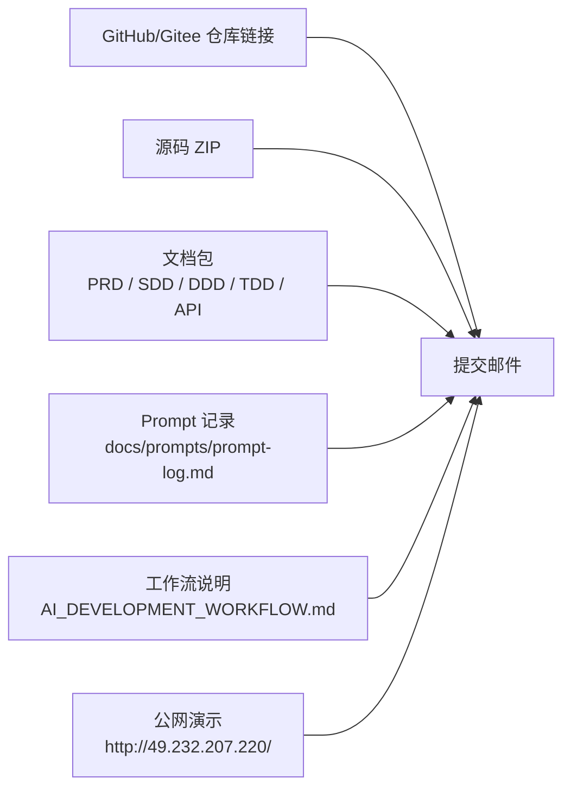
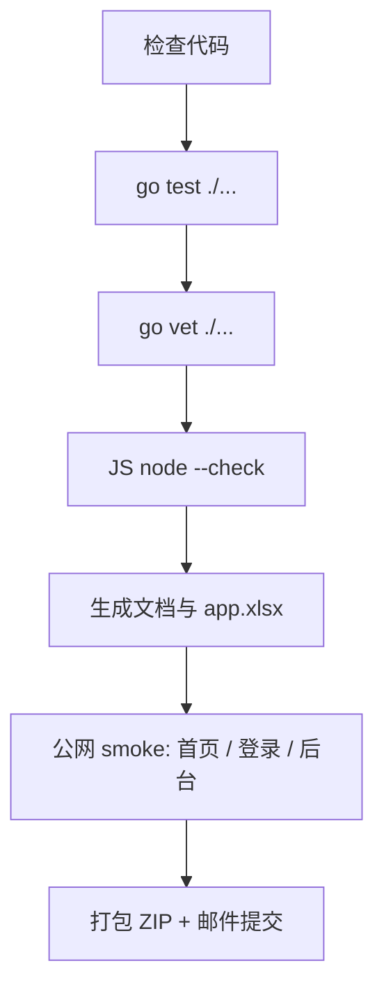

# 提交说明与交付清单

> 本文档用于最终提交前自检。开发语境统一为：本项目全部开发由 **接入 Kimi API 的 Claude Code** 完成；没有使用单一 Prompt 一次性生成整个项目。

## 1. 提交方式

| 项目 | 内容 |
|---|---|
| 提交邮箱 | `xulei@wisquest.com` |
| 邮件主题 | `【远程作业提交】姓名` |
| 附件/链接 | ZIP 源码包、Markdown 文档包、Prompt 记录、工作流说明、GitHub/Gitee 仓库链接、公网演示地址 |
| 截止时间 | 收到作业后 72 小时内 |



## 2. 演示入口

| 入口 | 地址 / 账号 |
|---|---|
| 公开演示 | `http://49.232.207.220/` |
| 普通用户登录 | `http://49.232.207.220/#/login` |
| 普通用户账号 | `user@100journeys.demo` / `TaoyuanUser12345` |
| 管理员隐藏登录 | `http://49.232.207.220/#/admin-login` |
| 管理员账号 | `admin@100journeys.demo` / `TaoyuanAdmin12345` |

说明：当前域名备案尚未完成，因此演示地址使用腾讯云 CVM 公网 IP。备案通过后，再将域名解析到 Nginx 并配置 HTTPS。

## 3. 硬性交付物映射

| 要求 | 对应文件 |
|---|---|
| 完整项目源码 | GitHub/Gitee 仓库 + ZIP 包 |
| 数据库初始化脚本 | `db/schema.sql`、`db/seed.sql` |
| 至少 5 条高质量样例数据 | `db/seed.sql` 中 12 条 journeys |
| README 运行说明和后台账号 | `README.md` |
| PRD | `docs/PRD.md`、`docs/INITIAL_PRD.md` |
| SDD / API 契约 | `docs/schema/SDD-spec.md`、`docs/schema/api-contract.md` |
| DDD / UI 设计说明 | `docs/ui-components/DDD-spec.md` |
| TDD / 测试说明 | `docs/testing/TDD-spec.md`、`docs/testing/test-plan.md` |
| Prompt 记录 | `docs/prompts/prompt-log.md` |
| 工作流说明 | `docs/workflow/AI_DEVELOPMENT_WORKFLOW.md` |
| Mermaid 图表 | README、PRD、SDD、DDD、Prompt log、`docs/generated/*.mmd` |
| 测试代码 | `internal/**/*_test.go`、`e2e/tests/*.spec.js`、`tests/load/*.js`、`tests/stress/stress_test.go` |
| 测试用例表 | `app.xlsx`、`docs/generated/app-test-cases.csv` |
| 部署与灾备说明 | `docs/ops/PRODUCTION_READINESS.md`、`docs/ops/DISASTER_RECOVERY.md` |

## 4. 提交前检查



推荐命令：

```bash
GOCACHE="$PWD/.cache/go-build" go test ./...
GOCACHE="$PWD/.cache/go-build" go vet ./...
find web/js -name '*.js' -exec node --check {} \;
python3 scripts/docs/generate_project_artifacts.py
node scripts/docs/build_app_xlsx.mjs
```
