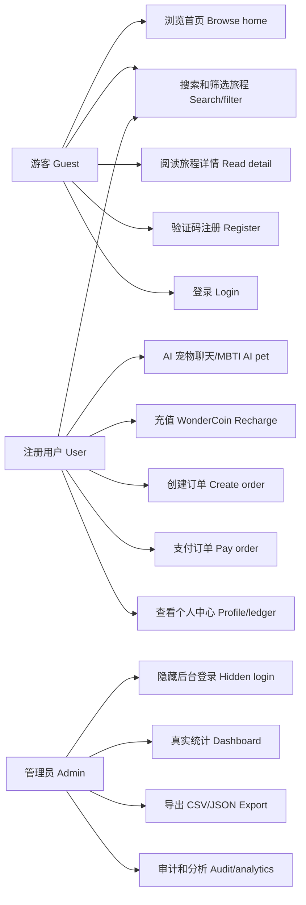
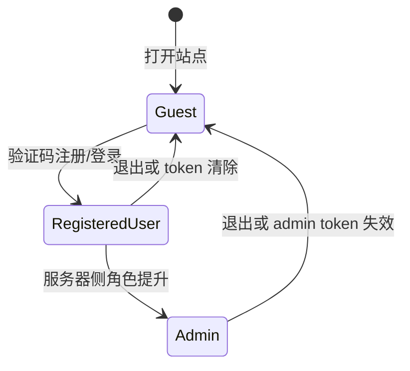

# 用户用例规格 - 100 Journeys

> 标准对齐: ISO/IEC/IEEE 29148:2018 干系人需求 + IEEE 1016-2009 context/interface viewpoints
> 生成图源: `docs/generated/user-cases.mmd`
> 路由来源: `web/js/router.js`、`cmd/server/main.go`、`internal/handler/*_handler.go`

---

## 1. 范围

本文档定义当前 `feature/taoyuan-production-readiness` 分支真实实现的用户角色、用户流程、页面访问矩阵和 API 权限矩阵。未完成能力不得写成已完成。

关联生成证据：

- 前端路由：`docs/generated/frontend-routes.md`
- API 路由：`docs/generated/api-routes.md`
- 来源追踪：`docs/generated/source-alignment.md`

## 2. 角色

| 角色 ID | 角色 | 权限级别 | 已实现边界 |
|---|---|---:|---|
| `ACT-001` | 游客 | L0 | 可浏览公开内容、搜索筛选、查看详情、注册登录、发送公开 analytics/client-error 事件。 |
| `ACT-002` | 注册用户 | L1 | 拥有游客能力，额外可进入个人中心、充值、下单、支付、查看交易流水、上传头像和使用 JWT API。 |
| `ACT-003` | 管理员 | L2 | 拥有用户能力，额外可通过隐藏入口登录后台、查看统计、用户列表、审计/分析数据并导出 CSV/JSON。管理员只能服务器侧创建或提升。 |

## 3. 用户用例图

## 4. 状态迁移

## 5. 功能用例

| 用例 ID | 参与者 | 触发 | 主流程 | 验收 |
|---|---|---|---|---|
| `UC-001` | 游客 | 打开 `/#/` | 首页 hero、情绪入口、精选卡片和 AI 宠物入口渲染。 | 第一屏能识别产品定位，至少有一个旅程卡片。 |
| `UC-002` | 游客 | 搜索/筛选 | Explore 发送后端支持的筛选值到 `/api/journeys`。 | 返回标准 envelope，并展示筛选结果。 |
| `UC-003` | 游客 | 点击旅程卡片 | 路由进入 `/#/journey/:slug` 并调用 `/api/journeys/:slug`。 | 展示故事、角色/任务/线索、标签、MBTI、价格。 |
| `UC-004` | 游客 | 注册 | 获取 captcha，提交 username/email/password/gender。 | 创建 role=`user` 的账号并返回 JWT。 |
| `UC-005` | 用户 | 充值 | Recharge 页调用 `/api/payments/recharge`。 | 余额增加并产生 recharge 流水。 |
| `UC-006` | 用户 | 下单 | Detail CTA 提交 journey slug 和 quantity。 | 订单有唯一订单号和价格快照。 |
| `UC-007` | 用户 | 支付 | 支付接口校验归属、余额和订单状态。 | 订单变为 paid，生成 purchase 流水。 |
| `UC-008` | 用户 | 查看个人中心 | Profile 调用 `/api/auth/me`、`/api/orders`、`/api/payments/transactions`。 | 用户可见头像、用户名、钱包、积分、订单和流水。 |
| `UC-009` | 管理员 | 打开 `#/admin-login` | 管理员登录后进入 `#/admin`。 | 普通用户不可访问后台数据。 |
| `UC-010` | 管理员 | 查看统计 | 后台调用 `/api/admin/stats`。 | 显示用户、订单、收入、点击、购买、MBTI、性别、审计指标。 |
| `UC-011` | 管理员 | 导出 | 后台调用 `/api/admin/export?format=csv|json`。 | 导出内容来自真实数据库聚合。 |

## 6. 页面访问矩阵

| 页面 | 游客 | 用户 | 管理员 | 说明 |
|---|---:|---:|---:|---|
| `#/` | 是 | 是 | 是 | 公开首页 |
| `#/explore` | 是 | 是 | 是 | 公开探索 |
| `#/journey/:slug` | 是 | 是 | 是 | 公开详情；下单需要登录 |
| `#/login` | 是 | 是 | 是 | 普通登录 |
| `#/register` | 是 | 是 | 是 | 普通注册，不可创建 admin |
| `#/profile` | 否 | 是 | 是 | JWT required |
| `#/recharge` | 否 | 是 | 是 | JWT required |
| `#/admin-login` | 是 | 是 | 是 | 隐藏入口，不在普通导航展示 |
| `#/admin` | 否 | 否 | 是 | admin required |
| `#/about` | 是 | 是 | 是 | 公开页面 |

## 7. API 权限矩阵

| API | 游客 | 用户 | 管理员 | 说明 |
|---|---:|---:|---:|---|
| `GET /api/journeys*` | 是 | 是 | 是 | 公开内容 |
| `GET /api/tags` / `GET /api/mbti` | 是 | 是 | 是 | 公开元数据 |
| `POST /api/ai/chat` | 是 | 是 | 是 | mock/rule AI |
| `POST /api/analytics/events` | 是 | 是 | 是 | P2 analytics |
| `POST /api/audit/client-error` | 是 | 是 | 是 | 前端错误审计 |
| `POST /api/auth/register` / `login` | 是 | 是 | 是 | captcha required |
| `GET /api/auth/me` / `POST /api/auth/avatar` | 否 | 是 | 是 | JWT required |
| `POST /api/orders` / `GET /api/orders*` / `POST /api/orders/:id/pay` | 否 | 是 | 是 | JWT required |
| `POST /api/payments/recharge` / `GET /api/payments/transactions` | 否 | 是 | 是 | JWT required |
| `GET /api/admin/users` / `stats` / `export` | 否 | 否 | 是 | admin required |

## 8. 明确未完成边界

- 收藏/保存旅程：`user_saved_journeys` 表存在，但完整 API/UX 未完成。
- 真实支付：不在范围内，当前为 WonderCoin 模拟支付。
- 真实 LLM：不在范围内，当前为 mock/rule engine。
- 无备案正式域名：不能承诺；当前只提供腾讯云公网 IP 演示，备案后再切正式域名和 HTTPS。
