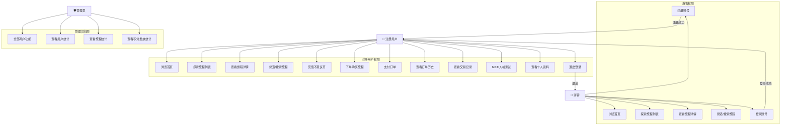
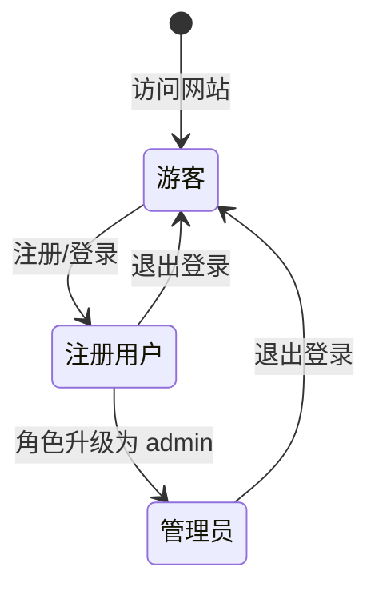

# 用户角色用例图

> 100种不可思议的旅行 — 用户角色与权限流程

---

## 角色定义

| 角色 | 权限级别 | 描述 |
|---|---|---|
| **游客 (Guest)** | L0 | 未登录用户，可浏览公开内容 |
| **注册用户 (User)** | L1 | 已登录用户，可使用全部核心功能 |
| **管理员 (Admin)** | L2 | 拥有后台管理权限，可查看统计数据 |

---

## 用例图

---

## 状态流转

---

## 页面访问权限矩阵

| 页面 | 游客 | 用户 | 管理员 |
|---|---|---|---|
| 首页 (/#/) | ✅ | ✅ | ✅ |
| 探索 (/#/explore) | ✅ | ✅ | ✅ |
| 详情 (/#/journey/:slug) | ✅ | ✅ | ✅ |
| 登录 (/#/login) | ✅ | ✅ | ✅ |
| 注册 (/#/register) | ✅ | ✅ | ✅ |
| 个人资料 (/#/profile) | ❌ → 跳转登录 | ✅ | ✅ |
| 充值 (/#/recharge) | ❌ → 跳转登录 | ✅ | ✅ |
| 管理员 (/#/admin) | ❌ → 跳转登录 | ❌ → 403 | ✅ |

---

## API 权限矩阵

| 接口 | 游客 | 用户 | 管理员 |
|---|---|---|---|
| GET /api/journeys | ✅ | ✅ | ✅ |
| GET /api/journeys/:slug | ✅ | ✅ | ✅ |
| GET /api/captcha | ✅ | ✅ | ✅ |
| POST /api/auth/register | ✅ | ✅ | ✅ |
| POST /api/auth/login | ✅ | ✅ | ✅ |
| GET /api/auth/me | ❌ | ✅ | ✅ |
| POST /api/orders | ❌ | ✅ | ✅ |
| GET /api/orders | ❌ | ✅ | ✅ |
| POST /api/payments/recharge | ❌ | ✅ | ✅ |
| GET /api/admin/stats | ❌ | ❌ | ✅ |
