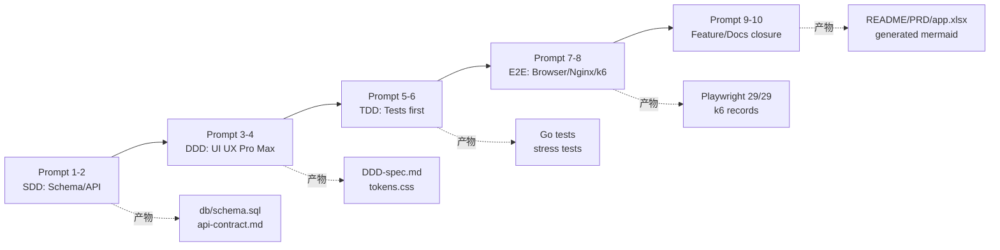
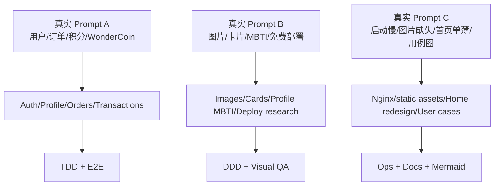

# 核心 Prompt 记录文档 - 100种不可思议的旅行

> 要求：至少 5 段核心 Prompt；必须体现 SDD、DDD、TDD、E2E 阶段；每段附 1-2 句说明。
> 开发工具语境：本项目全部开发记录为使用 **已接入 Kimi API 的 Claude Code** 完成。Claude Code 是唯一核心工程执行环境，Kimi API 是 Claude Code 本地 launcher 接入的模型/服务后端。
> 反一键生成说明：以下 Prompt 被拆分到不同阶段执行，先产出契约、设计、测试，再进入实现与验证；没有使用单一 Prompt 一次性生成整个项目。

---

## 用户提供的真实原始 Prompt（轻度润色版）

> 说明：本节保留用户在开发过程中提供的真实原始 Prompt，仅做标点、换行和少量错别字修正，尽量不改变原句和语气。这三段是后续 Feature、DDD/E2E、部署与性能优化的重要起点。

### 真实 Prompt A：用户、订单、积分与模拟支付

> 新增大规模真实用户注册登录测试，以及爆款大批量下单模式和多订单下单模式。用户主页要有购买历史，并为订单生成唯一订单号。新增积分制度功能。
> 之前已经有积分制度了，现在新增功能如果没有，那就一块新增。新用户注册即获得 5000 积分，积分用来评估用户等级，不同等级之间享有的特权不同。新增虚拟货币模拟支付系统。
> 模拟支付系统必须严格保证无安全漏洞，每笔交易、金额和订单都可追溯、可审计。模拟支付系统使用的虚拟货币叫不思议币，或者你起一个更好的名字。
> 模拟充值页面直接模拟游戏充值页面。模拟充值，不真充值；用户选择充多少，直接增加到他的账户即可。每个旅行包都要有自己的模拟金额，大概和真实费用对齐即可。
> 还有什么疑问和我遗漏的吗？这些功能也要写进 `doc/trace`，并保留原始 Prompt。

说明：这段 Prompt 直接驱动了用户系统、订单号、购买历史、积分等级、WonderCoin、充值页和交易流水审计。实现中用 SQLite 事务保护 P0 支付链路，并把原始 Prompt 保存在本文件和 trace 文档中。

### 真实 Prompt B：图片、卡片、MBTI 与免费部署

> 每个卡片的内容也可以增加多张图片和更多的正文介绍，图片缺失要修复。另外为什么找不到图片？你根本没存图片吧？你去网上找几张确实对应的图片不行吗？
> 旅游卡片当用户光标放上去时略微悬浮，并和背景形成层次，并显示出简洁动人的介绍。MBTI 是宠物专属互动环节，隐藏款，不直接放到首页，会在登录后的用户页单独显示。
> 每个 MBTI 不要只罗列名词，紫人、黄人、绿人这些都要做出来，并配上简短的人格描述，还要说明一下这个人格适合什么样的旅行。你直接参考高端旅行类网站的设计语言吧。
> 用免费图库可以，但是 Pages 离线必须存在。另外我还要单独部署全栈网页，在哪里能够免费部署？

说明：这段 Prompt 修正了图片缺失、placeholder 过多、首页/卡片层次弱和 MBTI 直接暴露的问题。后续实现改为 image2 辅助生成/整理图片素材、本地图片资产、JPG 压缩、卡片 hover 层次、登录后个人页 MBTI companion，并把全栈部署边界写入 ops 文档。

### 真实 Prompt C：启动性能、首页探索感、用例图和主题模式

> 方式一打不开，方式二确实能够打开了。但是终端里在跑一堆命令，启动速度太慢，图片并未加载完全。这是终端里面在跑的进程：
> `GET /static/assets/images/placeholder.jpg | 200 | ...` 连续出现多次，最后 `^C signal: interrupt`。
> 后端启动这一方面还要继续优化。另外很多新增功能是不是前端设计没有跟上？MBTI 性格测试在前端上太直接了，hero 屏幕是黑的，主页太单薄，用户没有探索感。
> 还要多做几个旅游卡片，点击旅游卡片有动效，正文的背景也要有动效。你可以参照权威高档网站的设计，并从 GitHub 上拉下来权威的 Claude design 来帮助你设计前端页面。
> 另外 user cases 也要画出来：游客、正式用户、管理员等。我们还要做一个深色和白天模式，可以自己切换，也可以跟随系统设置。还有自动登录，也就是 cookie。
> 之前的任务还有什么没做的？你还有什么问题和建议？

说明：这段 Prompt 推动了启动日志降噪、静态图片本地化、首页重新设计、User Cases Mermaid 图、明暗主题、登录态保持和 Nginx 静态资源优化。后续验证中通过 Playwright、截图审查和 k6/Nginx 记录确认主要问题已处理。

---

## Prompt 1 - SDD：业务需求到 Schema/API 契约

> 基于“100种不可思议的旅行”作业要求，先不要写业务代码。请使用 SDD（Spec/Schema-Driven Development）方式，把产品定位、用户画像、功能边界转成可审计的数据模型和 API 契约。数据库使用 SQLite，后端使用 Go + Gin，前端使用 Vanilla HTML/CSS/JS。必须先输出 `db/schema.sql`、`docs/schema/SDD-spec.md`、`docs/schema/api-contract.md`，并用 mermaid ER 图说明 journeys、tags、MBTI、users、orders、transactions、analytics_events、audit_logs 的关系。API 响应统一 envelope：`{ data, error, total?, page?, limit? }`。

说明：这个 Prompt 的意图是把自然语言需求先变成稳定契约，避免 Claude Code 在实现阶段自由发挥字段和接口。遇到的问题是“旅行内容展示”和“模拟交易”容易混在一起，因此要求先明确 P0 交易账本、P1 审计、P2 分析事件的边界。

## Prompt 2 - SDD：契约校验与代码对齐

> 请从 `db/schema.sql`、`cmd/server/main.go`、`internal/handler/*`、`internal/model/*` 反推当前真实 API 和字段，不要按想象补能力。检查文档中是否有不存在的接口、错误字段类型或错误示例，例如 MBTI compatibility score、订单 currency、收藏接口状态。所有 SDD/API 文档必须能被代码审计。

说明：这个 Prompt 用于修正模型幻觉和文档漂移。实际修正点包括 `compatibility_score` 采用 1-5 分制、订单货币统一为 `WONDER`、收藏能力标记为未完成而不是已交付。

## Prompt 3 - DDD：UI UX Pro Max 设计驱动

> 使用 UI UX Pro Max 的设计思路，为“桃源百旅 / 100种不可思议的旅行”设计一个轻量级内容展示 Web App MVP。风格方向是“曲径通幽、桃源百旅、Apple-like 简洁”，但不能做普通旅游列表页。请先输出 DDD 文档：Context viewpoint、Composition viewpoint、Interface viewpoint、Structure viewpoint；再把设计 token 写入 `web/css/tokens.css`，最后实现首页、探索页、详情页、登录注册、个人页、充值页、后台页。前端必须保持 Vanilla HTML/CSS/JS 和 Hash SPA。

说明：这个 Prompt 的意图是让视觉和组件结构先行，避免直接堆 HTML。遇到的问题是“不可思议”的业务痛点容易被还原成普通景点卡片，因此设计中加入情绪入口、MBTI、隐藏身份、角色/任务/线索等内容表达。

## Prompt 4 - DDD：视觉审查与响应式修正

> 对动态 Web SPA 的每个主要页面做浏览器截图审查，至少覆盖 `#/`、`#/explore`、`#/journey/:slug`、`#/login`、`#/register`、`#/profile`、`#/recharge`、`#/admin-login`、`#/admin`、`#/about`、错误页。桌面和移动都要检查固定导航遮挡、文本溢出、卡片标题遮挡、图片破图、充值卡片溢出、详情页按钮可点击、后台 dashboard 可用性。发现问题后只做最小范围修正。

说明：这个 Prompt 让 DDD 不停留在静态设计文档，而是通过真实浏览器截图验证。实际修正过详情页按钮被 fixed nav 遮挡、探索页筛选状态残留、首页引导按钮动画导致点击不稳定等问题。

## Prompt 5 - TDD：交易、认证、审计的测试先行

> 按 TDD 流程先写测试，再补实现。核心逻辑包括：注册必须包含 username/email/password/gender/captcha，密码必须 bcrypt 哈希；公开注册不能创建 admin；订单创建、余额扣减、支付状态、交易流水必须在 SQLite 事务中一致落库；充值是 WonderCoin 模拟充值；后台统计必须来自真实数据库聚合；API 错误、panic、前端错误必须进入 audit_logs。测试覆盖 repository、service、handler，并记录到 `docs/testing/TDD-spec.md`。

说明：这个 Prompt 的意图是把 P0 交易链路和权限边界用测试锁住，避免 UI 先行后出现账本不一致。遇到的挑战是 SQLite 单写模型在并发下容易暴露 busy/锁竞争，因此实现中加入单连接写入边界和 busy retry，同时保持压测请求端并发。

## Prompt 6 - TDD：50 个虚拟用户和 3 个管理员的真实行为链路

> 新增 50 个虚拟普通用户和 3 个管理员账号，用户信息必须完整：用户名、邮箱、必填 gender、bcrypt 密码、本地 GitHub-style 默认头像、钱包、积分、订单、交易流水、analytics 行为。用户名可以重复，但唯一账户身份由服务端内部 ID 绑定；前端个人页不展示内部数据库 ID。用真实 HTTP 行为链路验证注册、头像上传、充值、下单、支付、点击事件、后台统计和 CSV/JSON 导出。

说明：这个 Prompt 用于把“后台数据真实化”从硬编码改成可审计数据。实际挑战是既要满足用户资料完整，又不能把内部数据库 ID 暴露到展示层，因此文档和前端都采用用户名展示、服务端身份绑定的口径。

## Prompt 7 - E2E：完整浏览器链路

> 补完整 Playwright E2E：注册页加载、登录页加载、注册成功跳转、有效登录、错误密码、导航登录态、登出、profile 跳转、隐藏后台入口、普通用户禁止访问后台、探索页筛选/搜索/滑杆/详情跳转/load more、详情页返回/分享/404/收藏按钮、充值、下单、个人页订单和交易流水、10 用户顺序注册。E2E 必须通过本地 Nginx 入口执行，而不是只测 Go 直出。

说明：这个 Prompt 的意图是验证真实前端动态路由和代理部署边界。实际修正点包括 captcha-aware 测试 helper、探索分页判断、详情页按钮可点击、首页测试口径更新和订单支付流水断言；最新验证结果为 `29 passed`。

## Prompt 8 - E2E：Nginx、k6 和生产边界

> 补 Nginx 本地代理和生产模板，要求 `/api/` 反代 Go，`/static/css`、`/static/js`、`/static/assets`、`/uploads` 由 Nginx 直出或缓存；HTML shell 必须仍由 Go 注入 `window.APP_CONFIG`。写 k6 脚本覆盖公共浏览、注册登录、订单支付、后台统计导出、宠物聊天、图片缓存。压测要直接拉爆并记录边界，不能把本地通过说成无限生产级。

说明：这个 Prompt 把部署验证纳入 E2E 质量保障。实际发现 Go 直出静态图在极端并发下是瓶颈，因此部署方案明确为腾讯云 CVM + Nginx 反代 + Go 本机回环端口 + SQLite 持久化目录，并记录 auth/admin 重压下 p95 超阈值的边界。

## Prompt 9 - Feature：订单、积分与 WonderCoin 扩展

> 新增大规模真实用户注册登录测试和爆款大批量下单模式，以及多订单下单模式。用户主页要有购买历史，并为订单生成唯一订单号。新增积分制度：新用户注册即获得 5000 积分，积分用于评估用户等级，不同等级享有不同特权。新增虚拟货币模拟支付系统，模拟支付必须严格保证无安全漏洞，每笔交易和金额订单可追溯可审计。模拟货币叫不思议币 / WonderCoin。模拟充值页面参考游戏充值页面，不真充值，用户选择充多少就直接增加账户余额。每个旅行包要有模拟金额，大致和真实费用对齐。这些功能也要写进 `docs/trace` 并保留原始 prompt。

说明：这个 Prompt 推动项目从纯内容 MVP 扩展到可审计交易闭环。关键修正是把“充值/支付”明确为模拟能力，避免引入真实支付合规风险，同时要求订单号、交易流水、余额快照全部可追溯。

## Prompt 10 - Docs：最终文档与提交材料

> 文档必须严格符合作业图片要求：README 中英双语，其他文档中文；PRD、SDD、DDD、TDD、E2E、工作流说明、Prompt log、API 文档、测试矩阵、mermaid 图表必须和代码严格对齐。开发过程说明要写清楚如何通过接入 Kimi API 的 Claude Code 完成开发，不能写成其他工具替代；必须体现 SDD、DDD、TDD、E2E 的阶段性，以及遇到 2-3 个问题的解决路径。

说明：这个 Prompt 用于最终交付封口，重点是文档真实性和开发语境一致。实际处理是用生成脚本从 schema、路由和测试文件反推 `docs/generated/*` 与 `app.xlsx`，并统一说明“已接入 Kimi API 的 Claude Code 完成全部开发”。
