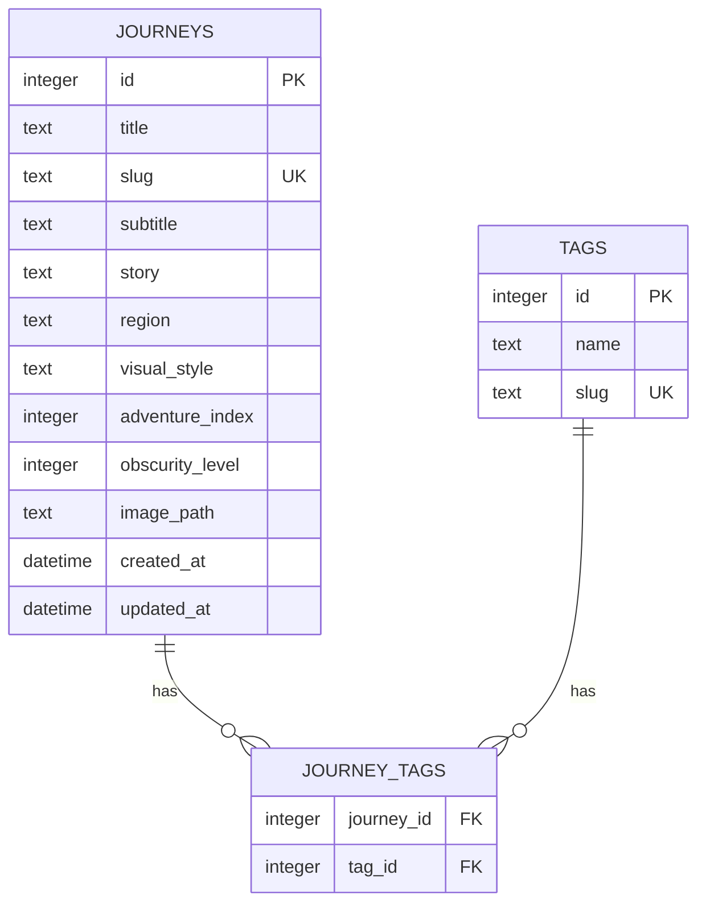

# Software Design Description — SDD
**Standard**: ISO/IEC/IEEE 29148:2018 — Requirements Engineering
**Project**: 100 Journeys Web App MVP
**Phase**: SDD — Spec/Schema-Driven Development
**Status**: DRAFT

---

## 1. Purpose & Scope (§6.2 per IEEE 29148)

This document defines the system-level requirements, data schemas, and API contracts for the 100 Journeys MVP. It serves as the binding specification that drives backend implementation and frontend data integration.

**In scope**: Journey listing, filtering, detail view, tag taxonomy, media resolution.
**Out of scope**: User accounts, bookmarks, comments, admin CMS.

---

## 2. Stakeholder Needs (§6.3)

| Stakeholder | Need |
|---|---|
| End user (95后/Z世代) | Browse unconventional journeys; filter by adventure level, visual style, tags |
| End user (visual consumer) | High-quality images, immersive story text |
| Developer | Clear API contract; schema drives frontend, no guesswork |
| Assessor | IEEE-compliant documentation trail |

---

## 3. System Requirements (§6.4)

### 3.1 Functional Requirements

| ID | Requirement | Priority |
|---|---|---|
| FR-001 | System shall list journeys with pagination (default 12/page) | Must |
| FR-002 | System shall filter journeys by tag slug | Must |
| FR-003 | System shall filter by visual_style enum | Must |
| FR-004 | System shall filter by adventure_index range (min/max) | Must |
| FR-005 | System shall filter by obscurity_level minimum | Should |
| FR-006 | System shall return full journey detail by slug | Must |
| FR-007 | System shall list all available tags | Must |
| FR-008 | System shall resolve image URL (local or CDN) transparently | Must |
| FR-009 | System shall serve SPA index.html for all non-API routes | Must |
| FR-010 | System shall inject APP_CONFIG into HTML at startup | Must |

### 3.2 Non-Functional Requirements

| ID | Requirement |
|---|---|
| NFR-001 | API response time < 200ms on local SQLite |
| NFR-002 | Zero CGO dependencies (pure Go build) |
| NFR-003 | CDN switch requires zero frontend code changes |
| NFR-004 | All endpoints return consistent JSON envelope: `{ data, error, total?, page?, limit? }` |

---

## 4. Data Schema (§6.5)

See `db/schema.sql` for authoritative DDL.

### Entity Relationship (Mermaid)


---

## 5. API Contract (§6.6)

See `docs/schema/api-contract.md` for full endpoint specification.

### Endpoint Summary

| Method | Path | Description |
|---|---|---|
| GET | /api/journeys | List with filters + pagination |
| GET | /api/journeys/:slug | Single journey detail |
| GET | /api/tags | All tags |
| GET | /api/health | Health check |

### Response Envelope (all endpoints)
```json
{
  "data":    <object|array|null>,
  "error":   <string|null>,
  "total":   <integer, list only>,
  "page":    <integer, list only>,
  "limit":   <integer, list only>
}
```

---

## 6. Implementation Constraints

- Repository layer MUST implement `JourneyRepository` interface (`internal/repository/journey_repo.go`)
- Service layer MUST use `MediaProvider` interface for all image URL resolution
- Handler layer MUST bind query params via Gin's `ShouldBindQuery` to `model.JourneyFilter`
- All DB operations MUST use parameterized queries (no string interpolation)

---

## 7. SDD Phase Gate Checklist

- [ ] Go installed, `go mod init` complete
- [ ] `modernc.org/sqlite` + `gin` dependencies added
- [ ] SQLite repository implementation complete
- [ ] All 4 API endpoints returning real data
- [ ] Manual API test against seed data (5 journeys)
- [ ] ER diagram rendered in README
- [ ] API contract marked FINAL
- [ ] Prompt log Phase 1 entry written
- [ ] CP-SDD-001 checkpoint created
- [ ] `v0.1.0-sdd` git tag created
