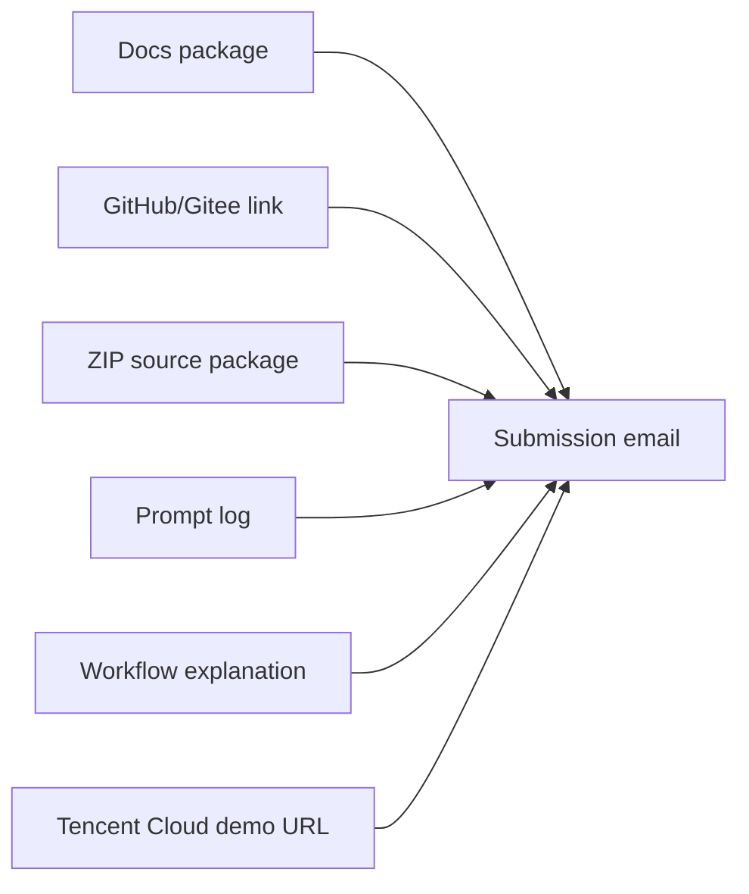

# Tencent Cloud Submission Hardening Plan

**Goal:** Finish the final submission branch for Tencent Cloud public-IP demo, Markdown documentation, Mermaid diagrams, prompt trace, workflow explanation, and minimal production hardening.

**Current deployment:** Tencent Cloud CVM `49.232.207.220`, Nginx public `:80`, Go API bound to `127.0.0.1:8080`, SQLite under `/var/lib/100-journeys`, secrets in `/etc/100-journeys/100-journeys.env`.

## Checklist

- [x] Keep private keys outside Git and docs.
- [x] Add Tencent Cloud rsync deployment filter.
- [x] Bind Go API to localhost in deployment.
- [x] Add README demo URL and user/admin accounts.
- [x] Add submission checklist document.
- [x] Replace old deployment wording with Tencent Cloud public-IP wording.
- [x] Final local tests.
- [x] Public smoke test after re-sync.
- [ ] Batch commits and push to GitHub.
