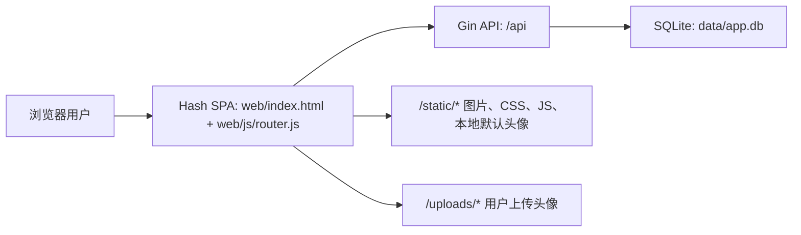
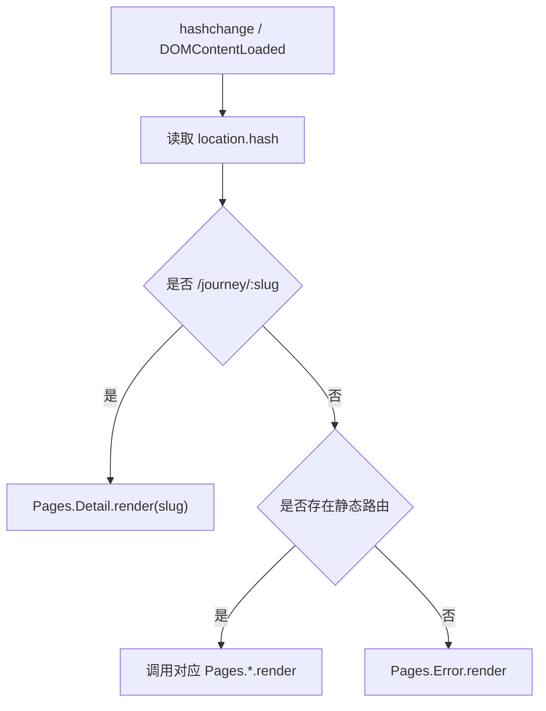
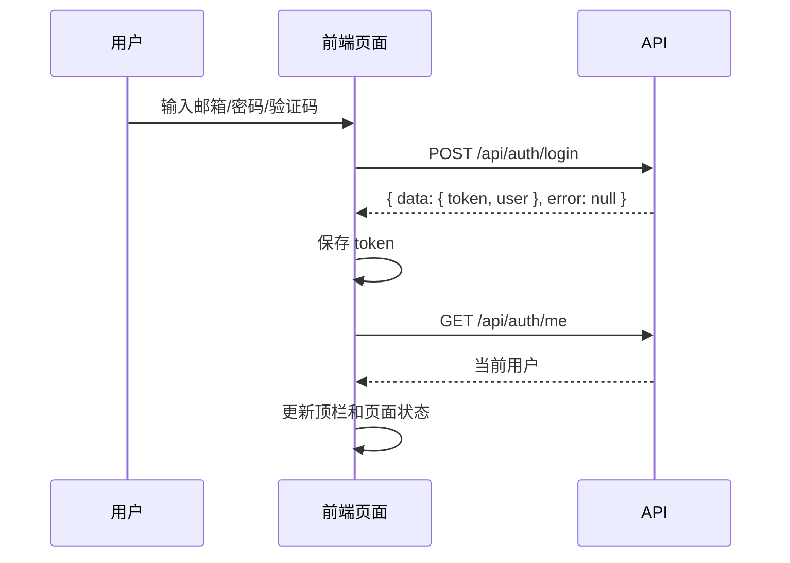

# DDD/UI 设计说明 — 100 Journeys

**标准**: IEEE 1016-2009 — Software Design Descriptions
**项目**: 100种不可思议的旅行 · Lightweight Content MVP
**状态**: 与当前代码对齐
**源码依据**: `web/index.html`、`web/js/router.js`、`web/js/pages/*.js`、`web/js/api.js`、`web/css/**`
**生成证据**: `docs/generated/frontend-routes.md`

> 图片素材工具：生成类旅行图、品牌图和默认头像资产使用 image2 辅助生成或整理。主体工程开发仍统一记录为接入 Kimi API 的 Claude Code 完成。

---

## 1. 设计范围与真实边界

当前前端是 Vanilla HTML / CSS / JS 实现的 Hash SPA，不使用 React、Vue 或服务端模板组件。Gin 服务只负责注入 `window.APP_CONFIG` 并返回静态资源；页面渲染、路由、状态读取和接口调用均在浏览器端完成。

本文档描述当前已存在的 UI 设计与交互结构，不把早期草稿中的 UIUXProMax 产物、React 组件或未实现功能写成事实。

---

## 2. Context Viewpoint — 上下文视图

### 2.1 运行上下文



### 2.2 前端路由

当前路由来自 `web/js/router.js`，生成证据见 `docs/generated/frontend-routes.md`。

| Hash 路由 | 页面模块 | 主要用途 |
|---|---|---|
| `#/` | `Pages.Home` | 首页、搜索入口、情绪/MBTI 快速入口、精选旅程 |
| `#/explore` | `Pages.Explore` | 旅程探索、筛选、分页或网格展示 |
| `#/journey/:slug` | `Pages.Detail` | 旅程详情、故事场景、预订信息 |
| `#/login` | `Pages.Login` | 普通用户登录 |
| `#/register` | `Pages.Register` | 普通用户注册 |
| `#/profile` | `Pages.Profile` | 用户资料、钱包/积分、订单、MBTI 伴侣区 |
| `#/admin-login` | `Pages.AdminLogin` | 管理员登录入口 |
| `#/admin` | `Pages.Admin` | 管理后台统计与用户列表 |
| `#/recharge` | `Pages.Recharge` | 钱包充值 |
| `#/about` | `Pages.About` | 关于页面 |

### 2.3 主要用户流

| 用户流 | 起点 | 关键页面 | 终点 |
|---|---|---|---|
| 内容浏览 | 首页 | `#/` → `#/explore` → `#/journey/:slug` | 阅读详情或跳转预订 |
| 搜索筛选 | 首页或探索页 | `#/explore?q=...&tag=...&mbti=...` | 更新旅程列表 |
| 注册登录 | 顶栏入口 | `#/register` / `#/login` | 返回首页或进入个人页 |
| 下单支付 | 详情页或个人页 | 订单 API → `#/profile` / `#/recharge` | 钱包扣款或充值 |
| 管理统计 | 管理员入口 | `#/admin-login` → `#/admin` | 查看统计、导出 CSV |

---

## 3. Composition Viewpoint — 组合视图

当前 UI 是全局壳层 + 页面模块的组合，不是框架组件树。

```text
web/index.html
├── #app-root
│   ├── nav.js 渲染顶栏
│   ├── router.js 根据 location.hash 分发页面
│   └── Pages.*
│       ├── Home
│       ├── Explore
│       ├── Detail
│       ├── Login
│       ├── Register
│       ├── Profile
│       ├── AdminLogin
│       ├── Admin
│       ├── Recharge
│       ├── About
│       └── Error
├── ai-pet-dom.js 悬浮 AI 宠物入口
├── client-audit.js 前端错误上报
└── CSS
    ├── tokens.css
    ├── global.css
    ├── layout.css
    ├── components/*
    └── pages/*
```

### 3.1 全局壳层

| 模块 | 文件 | 职责 |
|---|---|---|
| 配置注入 | `cmd/server/main.go`、`web/js/config.js` | 提供 `window.APP_CONFIG.apiBase` 和 `mediaBase` |
| API Client | `web/js/api.js` | 统一 fetch、Token header、JSON 请求、头像上传 |
| Router | `web/js/router.js` | Hash 路由解析、动态详情路由、未知路由错误页 |
| Nav | `web/js/nav.js` | 顶栏、登录态展示、管理员入口、退出 |
| Error Audit | `web/js/client-audit.js` | 上报前端错误到 `/api/audit/client-error` |
| AI Pet | `web/js/ai-pet-dom.js` | 悬浮对话、推荐动作、探索页跳转 |

### 3.2 页面模块

| 页面 | 文件 | 数据来源 | 核心 UI |
|---|---|---|---|
| 首页 | `web/js/pages/home.js` | `/api/journeys`、分析事件 | Hero、搜索、情绪入口、精选卡片 |
| 探索 | `web/js/pages/explore.js` | `/api/journeys`、`/api/tags` | 筛选栏、旅程网格、卡片点击 |
| 详情 | `web/js/pages/detail.js` | `/api/journeys/:slug`；购买按钮调用订单 API | 大图、故事、角色/任务/线索、预订 |
| 登录 | `web/js/pages/login.js` | `/api/captcha`、`/api/auth/login` | 邮箱密码、验证码、Token 保存 |
| 注册 | `web/js/pages/register.js` | `/api/captcha`、`/api/auth/register`、`/api/auth/avatar` | 用户名、性别、头像、验证码 |
| 个人页 | `web/js/pages/profile.js` | `/api/auth/me`、订单/流水 API | 用户资料、积分钱包、订单、MBTI |
| 管理登录 | `web/js/pages/admin-login.js` | `/api/auth/login` | 管理员登录和权限跳转 |
| 管理后台 | `web/js/pages/admin.js` | `/api/admin/stats`、`/api/admin/users`、导出 | 指标、分布、用户列表、CSV 导出 |
| 充值 | `web/js/pages/recharge.js` | `/api/payments/recharge` | 金额选择、充值提交 |
| 关于 | `web/js/pages/about.js` | 静态内容 | 项目介绍 |

---

## 4. Interface Viewpoint — 接口视图

### 4.1 前端配置接口

所有前端网络配置从 `window.APP_CONFIG` 读取。

```js
window.APP_CONFIG = {
  mediaBase: "/static/assets/images",
  apiBase: "/api"
};
```

约束：

- JS 不硬编码生产 API 域名。
- 图片基础路径默认指向本地 `/static/assets/images`；服务端媒体 provider 本地优先，缺失时可用 `CDN_BASE_URL` 做 fallback。
- API Client 使用 `apiBase` 拼接接口路径。

### 4.2 API Client 合同

`web/js/api.js` 暴露当前页面实际使用的能力：

| 方法 | 后端接口 | 返回 |
|---|---|---|
| `getJourneys(params)` | `GET /api/journeys` | 列表信封 |
| `getJourney(slug)` | `GET /api/journeys/:slug` | 详情信封 |
| `getTags()` | `GET /api/tags` | 标签信封 |
| `getCaptcha()` | `GET /api/captcha` | 验证码信封 |
| `register(data)` | `POST /api/auth/register` | AuthResponse 信封 |
| `login(data)` | `POST /api/auth/login` | AuthResponse 信封 |
| `me()` | `GET /api/auth/me` | User 信封 |
| `uploadAvatar(file)` | `POST /api/auth/avatar` | avatar_url 信封 |
| `createOrder(items)` | `POST /api/orders` | Order 信封 |
| `listOrders()` | `GET /api/orders` | Order[] 信封 |
| `payOrder(id)` | `POST /api/orders/:id/pay` | paid 信封 |
| `recharge(amount)` | `POST /api/payments/recharge` | recharged 信封 |
| `listTransactions()` | `GET /api/payments/transactions` | Transaction[] 信封 |
| `adminStats()` | `GET /api/admin/stats` | AdminStats 信封 |
| `adminUsers()` | `GET /api/admin/users` | User[] 或后台用户行信封 |

### 4.3 页面状态接口

| 状态 | 存储位置 | 使用者 |
|---|---|---|
| JWT Token | `localStorage.auth_token` 或 `sessionStorage.auth_token` | API Client、Nav、登录态页面 |
| 路由状态 | `window.location.hash` | Router、页面深链 |
| 查询筛选 | Hash query string | 首页、探索页 |
| 用户头像 | 本地默认头像 `/static/assets/images/avatars/github-default/*` 或用户上传 `/uploads/avatars/*` URL | Nav、Profile |
| 分析事件 | Beacon/fetch 到 `/api/analytics/events` | Home、Explore、Detail、AI Pet |

### 4.4 UI 元素合同

| UI 单元 | 输入 | 状态 | 输出/动作 |
|---|---|---|---|
| 顶栏 | 当前用户、Token、角色 | 未登录、普通用户、管理员 | 导航、退出、后台入口 |
| 旅程卡片 | Journey | 默认、hover、加载后 | 点击进入 `#/journey/:slug`，上报点击 |
| 筛选栏 | tags、query、style、mbti 等 | 默认、筛选中、空结果 | 更新 hash query 并重新拉取 |
| 登录/注册表单 | 表单字段、captcha | 输入中、提交中、错误 | 写入 Token，刷新顶栏 |
| 头像上传 | File | 选择、上传、错误 | 更新用户 avatar_url |
| 订单按钮 | journey slug、用户状态 | 未登录、已登录、余额不足 | 创建订单或引导充值 |
| 管理统计面板 | AdminStats | 加载、成功、权限错误 | 展示指标、分布、导出 |

---

## 5. Structure Viewpoint — 结构视图

### 5.1 CSS 层级

CSS 目录遵循项目要求的层级顺序：

```text
web/css/
├── tokens.css      # 设计变量：颜色、字体、间距、阴影等
├── global.css      # reset、body、基础排版
├── layout.css      # 页面容器、全局布局
├── components/     # nav、card、form、button 等可复用样式
└── pages/          # home、explore、detail、profile、admin 等页面样式
```

约束：

- 新增视觉变量应优先进入 `tokens.css`。
- 页面专属布局放入 `pages/*`，可复用控件放入 `components/*`。
- 不把页面状态写死到 HTML；页面模块负责 DOM 渲染。

### 5.2 JS 加载与依赖顺序

`web/index.html` 先加载配置、工具、API、页面模块，最后加载 `router.js`。路由定义依赖 `Pages.*` 已经存在。

关键结构约束：

- `router.js` 是分发入口，不直接保存业务数据。
- 页面模块通过 `API.*` 访问后端。
- 认证 Token 只由 API Client 统一读取并注入请求头。
- 前端错误由 `client-audit.js` 捕获并上报。

### 5.3 后端静态资源边界

Gin 当前直接服务：

- `/static/*` -> `./web`
- `/uploads/*` -> `UPLOAD_DIR`

生产环境如接入 Nginx/CDN/R2，应保持 `/static/` 路径可被边缘缓存；`CDN_BASE_URL` 只作为本地缺失媒体的服务器侧 fallback，不要求前端代码改动。

---

## 6. Behavior Viewpoint — 行为视图

### 6.1 路由行为



### 6.2 数据加载行为

页面渲染通常遵循：

1. 写入页面骨架或加载态。
2. 调用 `API.*` 或直接 `fetch`。
3. 读取统一信封的 `data`。
4. 渲染成功、空状态或错误状态。
5. 对浏览、点击、搜索、宠物行为上报分析事件。

### 6.3 认证行为



### 6.4 订单与钱包行为

订单、支付、充值属于 P0 事实数据，必须依赖后端事务与钱包流水；前端分析事件不能替代订单事实。

当前行为：

- 创建订单使用 `POST /api/orders`。
- 支付使用 `POST /api/orders/:id/pay`。
- 余额不足返回 `402`，前端应引导到 `#/recharge`。
- 充值使用 `POST /api/payments/recharge`。
- 流水使用 `GET /api/payments/transactions`。

### 6.5 管理后台行为

管理员登录后访问 `#/admin`，页面调用：

- `GET /api/admin/stats`
- `GET /api/admin/users`
- `GET /api/admin/export?format=csv`

无管理员权限时由后端返回 `403`；前端应回到登录或错误提示。

---

## 7. 风险与边界

| 风险/边界 | 当前事实 | 设计要求 |
|---|---|---|
| 收藏/保存旅程 | 后端 handler 草稿未注册，slug 到 journey_id 未补全 | 不在 UI 中宣称已完整可用；如需要可降级为 localStorage 草稿 |
| AI 对话 | 当前为 mock provider | 文案避免承诺真实外部模型能力 |
| 静态图片吞吐 | 当前 Gin 直出静态图，压测显示极端并发瓶颈 | 生产建议接入 Nginx/CDN/R2，保持 `/static/` 路径可缓存，缺失媒体由服务端 fallback |
| 分析事件 | 可缓冲、可降级 | 不承担支付、订单、钱包等事实记录 |
| API 错误信封 | 后端错误字段为 `error` | 前端错误展示应读取 `error`，避免只读 `message` |
| Hash 路由 | 无服务端路由 fallback 需求 | 深链依赖 `#/...`，不要改成 History API |
| 多人并行改文档 | 当前工作树存在其他文档改动 | 本设计只覆盖指定 UI 文档，不回滚其他文件 |

---

## 8. DDD 合规检查

| IEEE 1016 视图 | 本文档位置 | 状态 |
|---|---|---|
| Context viewpoint | 第 2 节 | 已覆盖 |
| Composition viewpoint | 第 3 节 | 已覆盖 |
| Interface viewpoint | 第 4 节 | 已覆盖 |
| Structure viewpoint | 第 5 节 | 已覆盖 |
| Behavior viewpoint | 第 6 节 | 已覆盖 |
| Risk/decision record | 第 7 节 | 已覆盖 |

本文档当前以真实源码为准；如后续路由、API、CSS 层级或页面模块变更，应同步更新 `docs/generated/frontend-routes.md` 与本文档。
