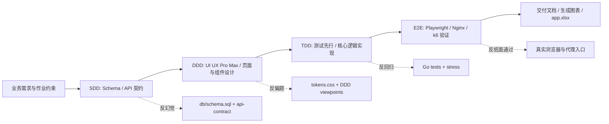

# 开发过程思路与工作流说明

> 项目：100种不可思议的旅行 · 轻量级内容展示 Web App MVP
> 开发工具语境：全部开发记录为使用 **已接入 Kimi API 的 Claude Code** 完成。Claude Code 是唯一核心工程执行环境，Kimi API 是其本地 launcher 接入的模型/服务后端。
> 方法论：SDD + DDD + TDD + E2E，避免“一键生成”，通过阶段门管理 AI 上下文和大模型幻觉。

---

## 1. 总体流程

本项目没有使用单一 Prompt 直接生成完整项目，而是按工程阶段拆分。每一阶段都先产生可审计产物，再进入下一阶段：

SDD 阶段先锁定 SQLite DDL、ER 图、API envelope 和接口边界。DDD 阶段再用 UI UX Pro Max 的设计要求，把“不可思议”从普通旅游列表还原为情绪、MBTI、隐藏身份、角色任务和故事线索。TDD 阶段用测试锁住注册、权限、订单、钱包、交易流水、后台统计和审计日志。E2E 阶段通过本地 Nginx 入口执行 Playwright、k6 和视觉截图审查，避免只在 Go 直出路径上得出错误结论。

## 2. Claude Code 结合 Kimi API 的使用方式

本项目使用已接入 Kimi API 的 Claude Code 作为工程执行环境。实际协同方式不是让 AI 一次性写完，而是要求 Claude Code 在每一阶段遵守输入/输出边界：

| 阶段 | Claude Code 输入 | 产出 | 防幻觉方式 |
|---|---|---|---|
| SDD | 作业图片、业务需求、技术栈约束 | `db/schema.sql`、SDD、API contract、ER 图 | 先定 schema/API，再写代码 |
| DDD | UI UX Pro Max 风格要求、用户画像 | DDD viewpoints、CSS tokens、页面组件 | 设计视图驱动 HTML/CSS/JS |
| TDD | 交易/认证/审计规则 | Go unit/integration/stress tests | 先写测试，再实现 |
| E2E | 用户主链路和部署入口 | Playwright、Nginx、k6、截图审查 | 真实浏览器和代理入口验证 |
| Docs | 代码、schema、路由、测试证据 | README、PRD、Prompt log、app.xlsx | 生成脚本反推，避免手写漂移 |

说明：Nginx、Playwright、k6、GitHub Actions、腾讯云 CVM 等属于验证、部署和运维工具；image2 属于图片资产生成工具。它们不改变主体开发语境。文档中统一表述为：主体开发由接入 Kimi API 的 Claude Code 完成，其他工具用于验证证据、部署运行、图片素材和交付检查。

## 3. 关键问题与解决路径

**问题一：旅行站很容易变成普通目的地列表。**
解决方式：在 DDD 阶段把首页和详情页设计成“桃源百旅”的故事入口，而不是搜索框加景点列表。前端落地了情绪入口、MBTI、幻想类型、临时身份、任务、线索和风险建议，让“不可思议”成为核心交互，而不是文案口号。

**问题二：模拟支付容易只有 UI，没有账本。**
解决方式：在 TDD 阶段把订单、余额扣减、交易流水放进同一个 SQLite 事务，并用 repository/handler 测试覆盖余额不足、多 item 订单、充值、支付和 profile 流水。WonderCoin 明确为模拟货币，不触碰真实支付合规。

**问题三：文档容易和代码漂移。**
解决方式：交付文档分为手写规范文档和代码派生文档两类。`docs/generated/*` 由脚本读取 `db/schema.sql`、`cmd/server/main.go`、前端路由和测试文件生成，`app.xlsx` 再从生成矩阵汇总。这样 ER 图、API 路由、E2E 文件数量和测试矩阵能和实际代码保持一致。

**问题四：本地能跑不代表生产就绪。**
解决方式：E2E 不只跑 Go 直出，而是通过本地 Nginx 代理入口验证 HTML 注入、API 反代、静态资源、安全头和缓存。k6 记录基线和重压边界：公共浏览、订单支付、图片缓存可以通过目标档；auth/admin 重压在 p95 上暴露边界，文档明确不宣称“无限生产级”。

## 4. 对工程化 AI 开发的理解

工程化 AI 开发的重点不是让模型“多写代码”，而是把模型约束在可验证流程里：先契约、再设计、再测试、后实现，最后用真实运行证据封口。Claude Code 适合承担工程执行，但必须给它明确的阶段门、文件边界和验收命令；Kimi API 作为接入后端提供模型能力，不能替代工程约束本身。

本项目的可审计证据包括：

- SDD：`db/schema.sql`、`docs/schema/SDD-spec.md`、`docs/schema/api-contract.md`
- DDD：`docs/ui-components/DDD-spec.md`、`web/css/tokens.css`
- TDD：`docs/testing/TDD-spec.md`、`internal/**/*_test.go`
- E2E：`e2e/tests/*.spec.js`、本地视觉审查截图记录
- 运维：`deploy/nginx.conf`、`deploy/tencentcloud.rsync-filter`、`scripts/deploy/*`
- 生成图表：`docs/generated/*.mmd`、`docs/generated/*.md`
