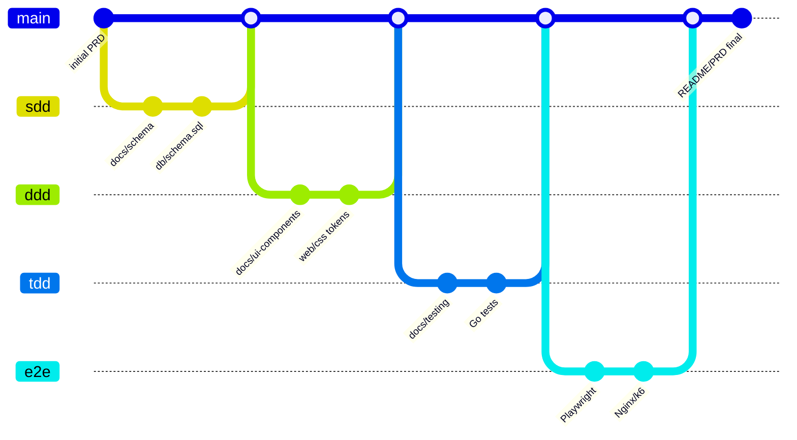
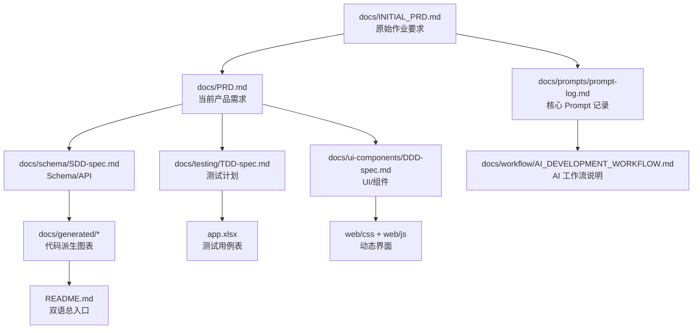

# 文档历史演进说明

> 目标：说明本项目文档不是最终一次性补写，而是从初始 PRD 出发，随着 Git 提交、阶段门和功能迭代持续增长。
> 形式：Markdown + Mermaid。
> 开发工具语境：使用已接入 Kimi API 的 Claude Code 完成全部开发。

---

## 1. 文档演进主线

说明：上图表达文档和代码的逻辑演进，不代表每个 Git 分支名都必须与图中一致。真实提交历史可对照 `docs/DEVELOPMENT_TIMELINE.md` 和 `git log`。

## 2. 文档从初始到当前的增长方式

| 阶段 | 文档增长 | 代码增长 | 证据 |
|---|---|---|---|
| 初始 PRD | `docs/INITIAL_PRD.md` 固化作业图片要求 | 项目骨架 | 原始需求、用户画像、交付要求 |
| SDD | `docs/schema/SDD-spec.md`、`api-contract.md`、ER 图 | `db/schema.sql`、repository、handler | schema/API 可追踪 |
| DDD | `docs/ui-components/DDD-spec.md`、tokens、组件视图 | `web/css/*`、`web/js/pages/*` | 页面结构和视觉行为 |
| TDD | `docs/testing/TDD-spec.md`、`test-plan.md` | Go tests、交易/认证/审计实现 | `go test ./...` |
| E2E | Playwright、k6、视觉截图审查记录 | `e2e/tests/*.spec.js`、Nginx/k6 scripts | `29/29`、k6 记录 |
| 交付封口 | README、PRD、Prompt log、workflow、app.xlsx | systemd/Nginx/CI/deploy scripts | 生成矩阵、运维检查 |

## 3. 文档依赖图

## 4. 防止文档漂移的规则

- 初始需求只在 `docs/INITIAL_PRD.md` 固化，不随着实现改写原始含义。
- 当前产品状态写入 `docs/PRD.md` 和 `docs/trace/CURRENT_STATE.md`。
- Schema/API/路由/测试矩阵优先由代码生成：`python3 scripts/docs/generate_project_artifacts.py`。
- `app.xlsx` 从 `docs/generated/app-test-cases.csv` 汇总生成。
- 若代码变更影响路由、schema、测试、部署脚本，必须同步 README、PRD、SDD/DDD/TDD、ops 文档。
