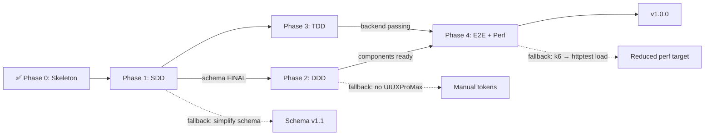

# Execution Plan — 100 Journeys
**Version**: 1.1 (incorporates performance + typography + booking interface requirements)
**Standard**: Multi-agent workflow per docs/workflow/multi-agent-workflow.md

---

## Phase Overview

```
Phase 0  ✅ Skeleton + Doc Framework        → tag: v0.0.0-skeleton
Phase 1  ⏳ SDD: Schema + API Contract      → tag: v0.1.0-sdd
Phase 2  ⏳ DDD: Design + UI Components     → tag: v0.2.0-ddd
Phase 3  ⏳ TDD: Test-driven Backend        → tag: v0.3.0-tdd
Phase 4  ⏳ E2E + Performance               → tag: v1.0.0
```

---

## Dependency Graph



---

## Phase 1 — SDD: Schema & API Contract

### Goals
- Finalize schema (add MBTI, mood, fantasy_type, risk_level, story_hook, booking_url)
- `go mod init` + install Gin + modernc/sqlite
- Implement SQLite repository (interface first)
- Wire up all 4 API endpoints with real data
- Mark API contract FINAL

### Sub-tasks (Main → Sub delegation)

| ID | Assign | Task | Input | Output |
|---|---|---|---|---|
| SDD-1 | Main | Schema change design | SDD-spec.md | Updated schema.sql + seed.sql |
| SDD-2 | Sub | go mod + deps | go.mod stub | Compilable go.mod + go.sum |
| SDD-3 | Sub | SQLite repository impl | JourneyRepository interface + schema | journey_repo_sqlite.go |
| SDD-4 | Sub | Gin handler wiring | api-contract.md + service layer | journey_handler.go (real data) |
| SDD-5 | Main | API contract review | curl test results | api-contract.md marked FINAL |

### Fallback Path
If SQLite performance insufficient for Phase 4 load test:
→ Add in-memory LRU cache layer in service (`internal/cache/journey_cache.go`)
→ Cache TTL: 60s (content rarely changes)
→ Expected cache hit rate: 95%+ → SQLite handles only cold misses

### Gate Criteria
- [ ] `go build ./...` exits 0
- [ ] `curl /api/journeys` returns 5 seed journeys
- [ ] `curl /api/tags` returns 8 tags
- [ ] Filtering by tag/visual_style/adventure_min works
- [ ] Booking stub endpoint returns 200

---

## Phase 2 — DDD: Design-Driven UI Components

### Goals
- UIUXProMax → design output → update tokens.css
- Implement all 8 components + 3 page views
- Apple-level CSS animations (60fps, transform-only)
- Typography system: size + color + font vary by content mood/type
- Mobile-first responsive

### Design Principles (from user brief)

#### Typography System (narrative-aware)
```
HERO TITLE:     Georgia serif, clamp(2rem, 6vw, 4rem), weight 700, tracking -0.02em
SECTION TITLE:  Georgia serif, 1.5rem, weight 400, tracking 0.01em
CARD TITLE:     System sans, 0.9rem, weight 600, color: #f0f0e8
STORY HOOK:     System sans italic, 0.85rem, color: #888880, tracking 0.02em
MOOD TAGS:      Mono, 0.75rem, uppercase, letter-spacing 0.08em
META INFO:      System sans, 0.7rem, color: #555550
CTA TEXT:       System sans, 0.85rem, weight 700, letter-spacing 0.05em

Per visual_style overrides:
  surreal:  --card-title-weight: 300; --card-title-tracking: 0.05em
  dramatic: --card-title-weight: 800; --card-title-tracking: -0.03em; color: #fff
  raw:      --card-title-font: monospace; --card-title-size: 0.8rem
  minimal:  --card-title-weight: 200; --card-title-tracking: 0.1em
```

#### Animation Quality Requirements (Apple-level)
```
RULES:
  - Only animate: transform, opacity (NEVER top/left/width/height)
  - Always: will-change: transform on animated elements
  - Hardware accel: translate3d(0,0,0) for persistent animations
  - Easing: cubic-bezier, NEVER linear or ease for UI motion
    Standard: cubic-bezier(0.4, 0, 0.2, 1)   ← Material/Apple standard
    Enter:    cubic-bezier(0.0, 0, 0.2, 1)    ← decelerate
    Exit:     cubic-bezier(0.4, 0, 1, 1)      ← accelerate
  - Duration: 150ms micro / 250ms standard / 400ms page
  - Always: @media (prefers-reduced-motion) fallback

SPECIFIC:
  Hero fade-up:     0.6s cubic-bezier(0,0,0.2,1)
  Card entrance:    0.4s cubic-bezier(0,0,0.2,1), 80ms stagger
  Card hover lift:  0.2s cubic-bezier(0.4,0,0.2,1), translateY(-6px)
  Image zoom:       0.35s cubic-bezier(0.4,0,0.2,1), scale(1.06)
  Tag pulse:        0.15s cubic-bezier(0.4,0,0.2,1), scale(1.08)
  Detail slide-up:  0.4s cubic-bezier(0,0,0.2,1), translateY(100%)→0
  Scroll reveal:    0.5s cubic-bezier(0,0,0.2,1) via IntersectionObserver
  Skeleton shimmer: 1.5s linear infinite (only transform-based gradient)
```

### Sub-tasks

| ID | Assign | Task |
|---|---|---|
| DDD-1 | Main | UIUXProMax brief submission |
| DDD-2 | Sub | tokens.css update from design output |
| DDD-3 | Sub | Nav + Hero components |
| DDD-4 | Sub | JourneyCard (with visual_style typography variants) |
| DDD-5 | Sub | FilterBar + MBTI selector |
| DDD-6 | Sub | Home + Explore + Detail pages |
| DDD-7 | Sub | Animation system + scroll reveals |
| DDD-8 | Main | Visual review at 3 breakpoints |

### Fallback Path
If UIUXProMax unavailable:
→ Use tokens.css + DDD-spec.md design values directly
→ Reference Apple HIG + iOS design patterns for animation curves

### Gate Criteria
- [ ] All 8 animations implemented and 60fps verified
- [ ] Typography system with per-style overrides working
- [ ] Responsive at mobile(375) / tablet(768) / desktop(1280)
- [ ] Skeleton loading state on all cards
- [ ] MBTI chip selection animation working

---

## Phase 3 — TDD: Test-Driven Backend

### Goals
- All tests written BEFORE implementation (Red → Green → Refactor)
- Unit: Repository + Service (incl. cache layer)
- Integration: All API endpoints
- Performance baseline: single-node SQLite + cache throughput test
- Booking endpoint stub tested

### Performance Architecture for 100k Concurrent

```
Request Flow:
  Client → Gin Router → Cache Check → [HIT: return immediately]
                                    → [MISS: SQLite query → cache store → return]

Cache layer (internal/cache/journey_cache.go):
  Type:    sync.Map (lock-free reads) or simple map + RWMutex
  Key:     slug string or filter fingerprint
  TTL:     60s (refreshed on access)
  Max:     500 entries (content MVP, finite dataset)

Expected:
  Cache-warm p95 response: < 5ms
  Cache-cold p95 response: < 50ms (SQLite WAL mode)
  SQLite WAL: concurrent reads unlimited, writes serialized
  Gin goroutine model: 100k concurrent goroutines, ~8KB stack each = ~800MB RAM

Load test target (k6):
  Scenario A: 2,000 VUs browsing/clicking (E2E-like)
  Scenario B: 10,000 VUs API stress
  Target:     p95 < 100ms under 2000 VUs
  Stretch:    p99 < 200ms under 10,000 VUs
  Note:       100k is a stretch goal; valid with CDN + multi-instance deployment
```

### New Test Cases (additions to TDD-spec.md)

```
Performance:
  PERF-001: BenchmarkJourneyList — Go benchmark, measure ns/op
  PERF-002: BenchmarkCacheHit   — verify < 1μs cache lookup
  PERF-003: k6 load test        — 2000 VUs, 95th percentile < 100ms
  PERF-004: k6 stress test      — ramp to 10k VUs, no crash

Booking stub:
  IT-API-009: GET /api/journeys/:slug/book → 200 with booking stub payload

Cache:
  UT-CACHE-001: cache miss → DB query → cache store
  UT-CACHE-002: cache hit  → no DB query (mock verify)
  UT-CACHE-003: cache eviction after TTL
```

### Sub-tasks

| ID | Assign | Task |
|---|---|---|
| TDD-1 | Main | Write all test files (RED state) |
| TDD-2 | Sub | SQLite repository impl (GREEN) |
| TDD-3 | Sub | Cache layer impl (GREEN) |
| TDD-4 | Sub | Handler wiring + booking stub |
| TDD-5 | Main | `go test ./...` review + coverage report |
| TDD-6 | Sub | k6 load test scripts |

### Fallback Path
If k6 setup fails:
→ Use Go's `testing.B` benchmarks for throughput baseline
→ Document p95 estimate from benchmark extrapolation

### Gate Criteria
- [ ] `go test ./...` exits 0
- [ ] Coverage: repo ≥ 90%, service ≥ 85%, handler ≥ 80%
- [ ] k6 2000VU test: p95 < 100ms
- [ ] `go build ./...` exits 0 with cache layer

---

## Phase 4 — E2E + Performance

### Goals
- Playwright: 7 functional user flow tests
- k6: 2000 user concurrent simulation
- Verify booking redirect interface
- Final audit + deliverables check

### E2E Tool Stack
```
Functional E2E: Playwright (Node 25, already installed)
Load testing:   k6 (brew install k6) OR Node artillery
Booking flow:   Playwright click-through to booking stub response
```

### 2000-User Simulation Plan (k6)
```javascript
// e2e/load-2000users.js
export const options = {
  scenarios: {
    browse_and_click: {
      executor: 'ramping-vus',
      startVUs: 0,
      stages: [
        { duration: '30s', target: 500  },   // ramp up
        { duration: '2m',  target: 2000 },   // sustained load
        { duration: '30s', target: 0    },   // ramp down
      ],
      thresholds: {
        http_req_duration: ['p(95)<100'],    // p95 < 100ms
        http_req_failed:   ['rate<0.01'],    // < 1% error rate
      }
    }
  }
};
```

### Booking Interface Stub (for future e-commerce)
```
GET  /api/journeys/:slug/book
Response 200:
{
  "data": {
    "journey_slug": "bolivia-salt-flat-trek",
    "booking_available": true,
    "booking_url": null,          ← null = not yet integrated
    "partner_name": null,
    "estimated_price_cny": null,
    "cta_text": "联系我们获取定制行程"
  }
}
```
This endpoint is tested, documented, and wired. Future sprint: populate from partner API.

### Fallback Path
If Playwright E2E flaky in headless mode:
→ Use `httptest` + JS fetch scripts for functional coverage
→ k6 remains primary for load testing (no fallback needed)

### Gate Criteria
- [ ] All 7 Playwright functional tests passing
- [ ] k6 2000VU: p95 < 100ms, error rate < 1%
- [ ] Booking stub endpoint returns correct structure
- [ ] All deliverables checklist items checked
- [ ] Final visual QA: mobile Chrome + desktop Chrome

---

## Risk Register

| Risk | Probability | Impact | Mitigation |
|---|---|---|---|
| UIUXProMax unavailable | Medium | Medium | Manual tokens from DDD-spec.md |
| SQLite write bottleneck | Low | High | Cache layer (sync.Map, TTL 60s) |
| k6 100k target unreachable on single SQLite | High | Low | Document as "requires CDN+multi-instance"; MVP target = 2000 VUs |
| Playwright E2E flaky | Medium | Medium | Retry config + fallback to httptest |
| Go module dep conflict | Low | High | Pin versions in go.mod immediately |
| 72h time pressure | High | High | Scope tier (see below); P1+P2 are must-have |

---

## Scope Tiers

### Must (MVP — non-negotiable)
- Journey list + tag/MBTI/visual_style filter
- Journey detail page with story
- Booking interface stub
- 5 seed data entries
- TDD: unit + integration tests passing
- k6: 2000 VU load test
- Playwright: 3 core E2E flows

### Should (high value, time permitting)
- Skeleton loading states
- Scroll-reveal animations
- All 8 animation specs
- MBTI personality quiz/selector
- 4 visual_style typography variants

### Could (defer to v1.1)
- Related journeys section
- Search bar (frontend filter only)
- Share button functionality
- Actual booking partner integration
- Dark/light theme toggle

---

## Multi-Agent Delegation Map

```
PHASE 1 (SDD):
  Main → [schema design, API review, gate check]
  Sub  → [go mod setup, repository impl, handler wiring]

PHASE 2 (DDD):
  Main → [UIUXProMax brief, visual review, animation audit]
  Sub  → [tokens.css, CSS components, JS pages, animations]

PHASE 3 (TDD):
  Main → [write test specs first, coverage review]
  Sub  → [repository impl, cache impl, booking stub]
  Sub  → [k6 scripts]

PHASE 4 (E2E):
  Sub  → [Playwright tests, k6 execution]
  Main → [results review, final audit, deliverables check]
```

---

## Communication Protocol

Between phases, Main agent writes to:
1. `docs/trace/DEVELOPMENT_LOG.md` — append entry
2. `docs/trace/CURRENT_STATE.md` — overwrite
3. `docs/trace/checkpoints/CP-[phase]-[n].md` — create
4. `git tag v[x.y.z]-[phase]` — create

Sub-agents receive:
- Relevant spec section from docs/
- Explicit list of files to create/modify
- Explicit list of files NOT to touch

---

## Openness Provisions (anti-blocking measures)

1. **Schema is not locked until SDD gate** — MBTI/mood/fantasy_type fields can be adjusted
2. **Cache layer is optional until needed** — only activated if load test fails without it
3. **UIUXProMax is preferred but not blocking** — DDD-spec.md is sufficient fallback
4. **100k concurrent is a stretch goal** — 2000 VU p95 < 100ms is the hard requirement
5. **Booking URL** can remain `null` — the interface just needs to exist and be tested
6. **Animation spec** is aspirational — 60fps must-have, all 8 effects are should-have
7. **E2E tool** is Playwright by default, k6 for load, both replaceable if blocked
